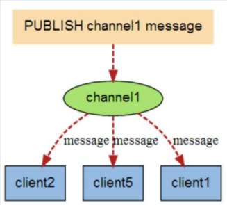
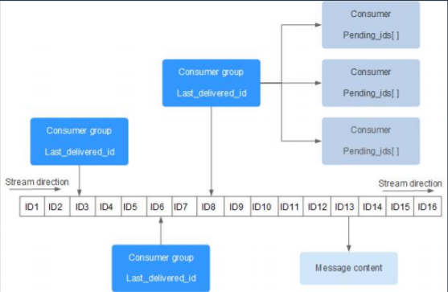
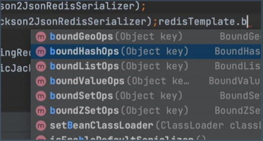

[TOC]

# Redis基本功能

Redis 安装:推荐docker

默认16个数据库 0-15

## 性能测试

```sql
redis-benchmark -n 100000 -c 32 -t SET,GET,INCR,HSET,LPUSH,MSET -q
redis-benchmark -n 100000 -c 32 //有更详细的信息
```

## 五种基本数据结构

### 字符串（string）

简单来说就是三种：int、string、byte[] 

字符串类型是Redis中最为基础的数据存储类型，它在Redis中是二进制安全的，这便意味着该类型可以接受任何格式的数据，如JPEG图像数据或json对象描述信息等。

在 Redis中字符串类型的value最多可以容纳的数据长度是512M。 

字符串操作：/get/getset/del/exists/append 

整数操作：incr/decr/incrby/decrby 

注意： 

1、字符串append性能问题：会使用更多的内存，存在缓冲区，存在内存浪费，可以使用set直接进行覆盖

2、整数共享：如果能使用整数，就尽量使用整数，如果限制了redis内存+LRU ，整数共享可能会失效

3、整数精度问题：redis大概能保证16~ ，，17-18位的大整数就会丢失精确

### 散列（hash）- Map 

Redis中的Hash类型可以看成具有String key 和String value的map容器。所以该类型 非常适合于存储对象的信息。如Username、password和age。如果Hash中包含少量 的字段，那么该类型的数据也将仅占用很少的磁盘空间。 

基本操作：hset/hget/hmset/hmget/hgetall/hdel/hincrby/hexists/hlen/hkeys/hvals

### 列表（list）~ java的LinkedList 

在Redis中，List类型是按照插入顺序排序的字符串链表。和数据结构中的普通链表 一 样，我们可以在其头部(Left)和尾部(Right)添加新的元素。在插入时，如果该键并不存 在，Redis将为该键创建一个新的链表。与此相反，如果链表中所有的元素均被移除， 那么该键也将会被从数据库中删除。

基本操作： lpush/rpush/lrange/lpop/rpop

### 集合（set）~ java的set，不重复的list 

在redis中，可以将Set类型看作是没有排序的字符集合，和List类型一样，我们也可以在该类型的数值上执行添加、删除和判断某一元素是否存在等操作。这些操作的时间复杂度为O(1),即常量时间内完成依次操作。 

和List类型不同的是，Set集合中不允许出现重复的元素。 

sadd     srem    smembers      sismember 

sdiff/sinter/sunion ~ 差集，交集，并集

### 有序集合（sorted set） 

sortedset和set极为相似，他们都是字符串的集合，都不允许重复的成员出现在一个 set中。

他们之间的主要差别是sortedset中每一个成员都会有一个分数与之关联。redis 正是通过分数来为集合的成员进行从小到大的排序。sortedset中分数是可以重复的。 

```
zadd key score member score2 member2... : 将成员以及该成员的分数存放到sortedset中 

zscore key member : 返回指定成员的分数 

zcard key : 获取集合中成员数量 

zrem key member [member...] : 移除集合中指定的成员，可以指定多个成员 

zrange key start end [withscores] : 获取集合中脚注为start-end的成员，[withscores]参数表明返回的成员 包含其分数 

zrevrange key start stop [withscores] : 按照分数从大到小的顺序返回索引从start到stop之间的所有元素 （包含两端的元素） 

zremrangebyrank key start stop :按照排名范围删除元素
```


## 三种高级数据结构（封装基础数据结构）

### Bitmaps：setbit/getbit/bitop/bitcount/bitpos 

去重，幂等

bitmaps不是一个真实的数据结构。而是String类型上的一组面向bit操作的集合。由于 strings是二进制安全的blob，并且它们的最大长度是512m，所以bitmaps能最大设置 2^32个不同的bit。 

### Hyperloglogs：pfadd/pfcount/pfmerge 

在redis的实现中，您使用标准错误小于1％的估计度量结束。这个算法的神奇在于不再 需要与需要统计的项相对应的内存，取而代之，使用的内存一直恒定不变。最坏的情况 下只需要12k，就可以计算接近2^64个不同元素的基数。 

### GEO：geoadd/geohash/geopos/geodist/georadius/georadiusbymember 

Redis的GEO特性在 Redis3.2版本中推出，这个功能可以将用户给定的地理位置（经 度和纬度）信息储存起来，并对这些信息进行操作。


# Redis 到底 是单线程，还是多线程？ 

redis作为一个进程一直都是多线程，IO线程，内存处理线程，备份线程等

- IO线程：
  - redis 6之前（2020年5月），单线程
  - redis 6之后，多线程，NIO模型 ==> 主要的性能提升点 

- 内存处理线程： 
  - 单线程 ==> 高性能的核心，整个redis的顶层设计都是基于单线程，这里不会改

# Redis六大使用场景

## 业务数据缓存(常用)

通用数据缓存

实时热数据

会话缓存，token缓存


## 业务数据处理

非严格一致性要求的数据：评论，点击

业务数据去重：订单处理的幂等校验，可以跨节点

业务数据排序：排名，排行榜


## 全局一致计数(常用)

全局流控计数

秒杀的库存计算

抢红包

全局ID生成


## 高效统计计数

全局bitmap操作：id去重，记录访问ip

UV、PV等访问量（非严格一致性要求）


## 发布订阅与Stream

1、Pub-Sub 模拟队列 

subscribe comments 

publish comments java




2、Redis Stream 是 Redis 5.0 版本新增加的数据结构。 

Redis Stream 主要用于消息队列（MQ，Message Queue）。 

具体可以参考 https://www.runoob.com/redis/redis-stream.html



## 分布式锁（面试）

关键点：原子性、互斥、超时

1、获取锁--单个原子性操作 

SET dlock my_random_value NX PX 30000 

2、释放锁--lua脚本-保证原子性+单线程，从而具有事务性 

```lua
if redis.call("get" ,KEYS[1]) == ARGV[1] then 
	return redis.call("del" ,KEYS[1]) 
else 
    return 0 
end 
```


# Redis的Java客户端

## Jedis 

官方客户端，类似于JDBC，可以看做是对redis命令的包装。 

基于BIO，线程不安全，需要配置连接池管理连接

## Lettuce

 目前主流推荐的驱动，基于Netty NIO，API线程安全

Spring 推荐

## Redission

 基于Netty NIO，API线程安全。 

亮点：大量丰富的分布式功能特性，比如JUC的线程安全集合和工具的分布式版本，分 布式的基本数据类型和锁等。


# Redis与Spring整合

## Spring Data Redis 

核心是 RedisTemplate(可以配置基于Jedis，Lettuce，Redisson) 

使用方式类似于MongoDBTemplate，JDBCTemplate或JPA 

封装了基本redis命令操作




## Spring Boot与Redis集成 

引入 spring-boot-starter-data-redis 配置 spring redis


## Spring Cache与Redis集成 

默认使用全局的CacheManager自动集成

 使用ConcurrentHashMap或ehcache时，不需要考虑序列化问题。 

redis的话，需要： 

1、默认使用java的对象序列化，对象需要实现Serializable 

2、自定义配置，可以修改为其他序列化方式


## MyBatis项目集成cache示例 

1. 集成spring boot与mybatis，实现简单单表操作，配置成rest接口
2. 配置ehcache+mybatis集成，实现mybatis二级缓存
3. 配置spring cache+ehcache缓存，实现方法级别缓存
4. 修改spring cache使用redis远程缓存代替ehcache本地缓存
5. 修改spring cache使用jackson json序列化代替java序列化
6. 整个过程中，使用wrk压测rest接口性能，并分析为什么? 
7. 尝试调整各种不同的配置和参数，理解cache原理和用法

# Redis高级功能