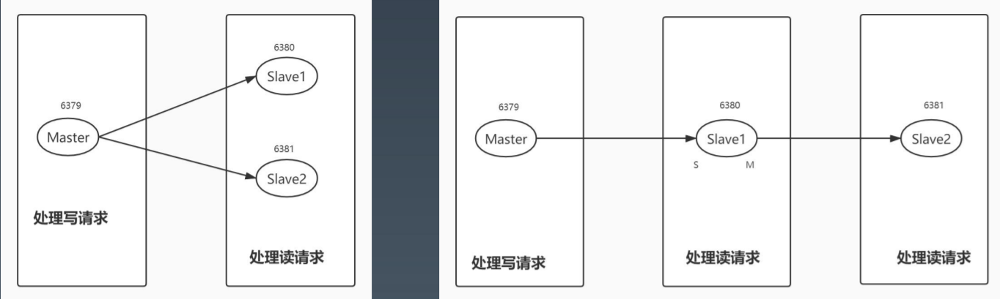
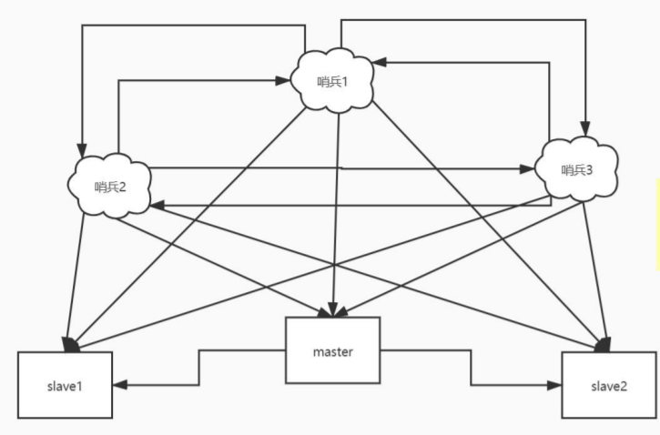
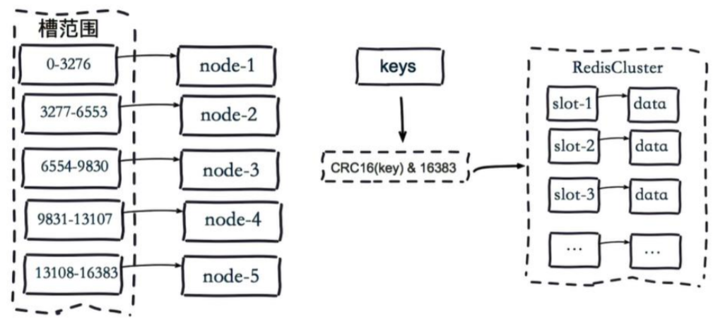

## Redis 主从复制：从单机到多节点

极简的风格, 从节点执行: 

```
> SLAVEOF 127.0.0.1 6379
```

也可以在配置文件中设置。 

> 注意：从节点只读、异步复制
>
> 从节点会获取到主节点的`dump.rdb `，加载后同步数据
>
> 类似注册中心




## Redis Sentinel 主从切换

可以做到监控主从节点的在线状态，并做切换（基于raft协议）


 ```
//两种启动方式：
redis-sentinel sentinel.conf
redis-server redis.conf --sentinel sentinel.conf
 ```

```
//sentinel.conf配置：
sentinel monitor mymaster 127.0.0.1 6379 2
sentinel down-after-milliseconds mymaster 60000
sentinel failover-timeout mymaster 180000
sentinel parallel-syncs mymaster 1
```

不需要配置从节点，也不需要配置其他sentinel信息 

redis sentinel原理介绍：http://www.redis.cn/topics/sentinel.html 

redis复制与高可用配置：https://www.cnblogs.com/itzhouq/p/redis5.html




## Redis Cluster：走向分片

主从复制从容量角度来说，还是单机

`Redis Cluster`通过一致性hash的方式，将数据分散到多个服务器节点：先设计 `16384` 个哈希槽，分配到多台`redis-server`。当需要在 `Redis Cluster`中存取一个 key时， Redis 客户端先对 key 使用 crc16 算法计算一个数值，然后对 `16384` 取模，这样每个 key 都会对应一个编号在 0-16383 之间的哈希槽，然后在 此槽对应的节点上操作



```
cluster-enabled yes
```

> 注意： 
>
> 1、节点间使用gossip通信，规模<1000 
>
> 2、默认所有槽位可用，才提供服务 
>
> 3、一般会配合主从模式使用

redis cluster介绍：http://redisdoc.com/topic/cluster-spec.html 

redis cluster原理：https://www.cnblogs.com/williamjie/p/11132211.html 

redis cluster详细配置：https://www.cnblogs.com/renpingsheng/p/9813959.html


# Redis的Java分布式组件库-Redission

基于Netty NIO，API线程安全。 

亮点：大量丰富的分布式功能特性，比如JUC的线程安全集合和工具的分布式版本，分 布式的基本数据类型和锁等。

官网：https://github.com/redisson/redisson

分布式锁，RLock ==> 能实现跨节点的锁状态

分布式的Map，RMap ==> 全集群共享的，一个机器改了，其他都会自动同步


# Hazelcast介绍

Hazelcast IMGD(in-memory data grid) 是一个标准的内存网格系统；它具有以下的一些基本特性： 

1. 分布式的：数据按照某种策略尽可能均匀的分布在集群的所有节点上。
2. 高可用：集群的每个节点都是 active 模式，可以提供业务查询和数据修改事务；部分节点不可用，集群依然可以提供业务服务。 
3. 可扩展的：能按照业务需求增加或者减少服务节点。 
4. 面向对象的：数据模型是面向对象和非关系型的。在 java 语言应用程序中引入 hazelcast client api是相当简单的。 
5. 低延迟：基于内存的，可以使用堆外内存。 

文档：https://docs.hazelcast.org/docs/4.1.1/manual/html-single/index.html