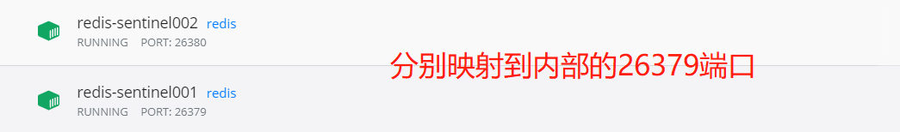

# 配置主从


### 获取容器内网的ip地址等信息

docker inspect redis001   ---->  172.17.0.2:6379

docker inspect redis002   ---->  172.17.0.3:6379

### 配置主从

从节点 redis002 中执行 `slaveof 172.17.0.2 6379`

将redis002 配置成了redis001的从节点

### 取消主从

从节点redis002 执行 `slaveof no one`

# 配置Sentinel哨兵




直接进入redis容器内部进行配置

```
docker exec -ti 5319843e8550 /bin/bash
```

进入根目录创建sentinel.conf文件

```
cd / 
touch sentinel.conf
```

修改文件内容为：

```
echo 'sentinel monitor mymaster 172.17.0.3 6379 2' >> sentinel.conf
```

最后，启动Redis哨兵：

```
redis-sentinel /sentinel.conf
```


# 配置 Cluster

