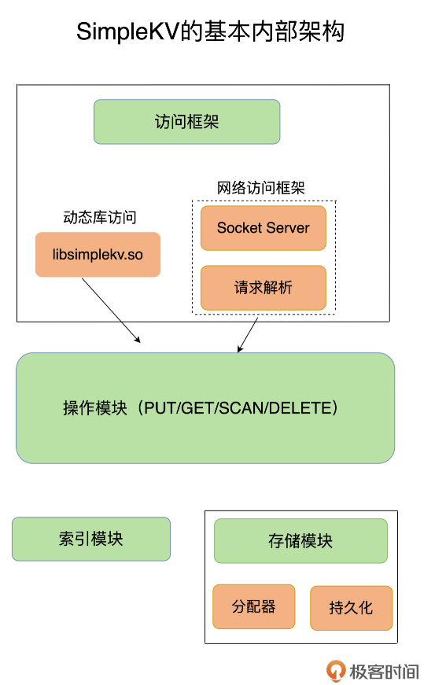
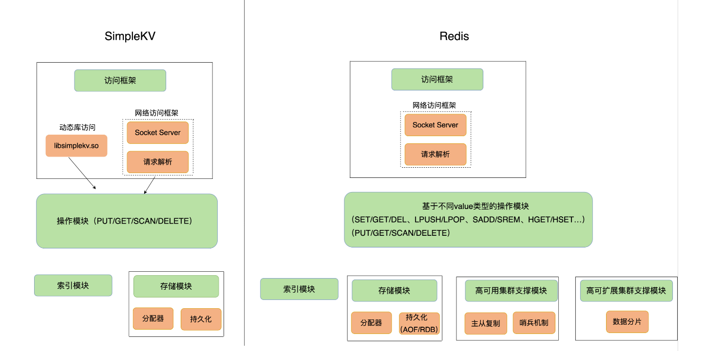

更好的学习方式就是先建立起“`系统观`”

一个键值数据库包括了`访问框架`、`索引模块`、`操作模块`和`存储模块`四部分，我们从这四个部分入手，构建我们的 SimpleKV

## 采用什么访问模式？

访问模式通常有两种：

一、通过函数库调用的方式供外部应用使用，比如，上图中的 libsimplekv.so，就是以动态链接库的形式链接到我们自己的程序中，提供键值存储功能；

二、通过网络框架以 Socket 通信的形式对外提供键值对操作，网络框架中包括 Socket Server 和协议解析。（Redis使用）

> 通过网络框架提供键值存储服务，一方面扩大了键值数据库的受用面，但另一方面，也给键值数据库的性能、运行模型提供了不同的设计选择，带来了一些潜在的问题。
>
> 举个例子，当客户端发送一个如下的命令后，该命令会被封装在网络包中发送给键值数据库：`PUT hello world`
>
> 键值数据库网络框架接收到网络包，并按照相应的协议进行解析之后，就可以知道，客户端想写入一个键值对，并开始实际的写入流程。此时，我们会遇到一个系统设计上的问题，简单来说，就是**网络连接的处理**、**网络请求的解析**，以及**数据存取的处理**，是用一个线程、多个线程，还是多个进程来交互处理呢？该如何进行设计和取舍呢？我们一般把这个问题称为 I/O 模型设计。不同的 I/O 模型对键值数据库的性能和可扩展性会有不同的影响。
>
> 举个例子，如果一个线程既要处理网络连接、解析请求，又要完成数据存取，一旦某一步操作发生阻塞，整个线程就会阻塞住，这就降低了系统响应速度。如果我们采用不同线程处理不同操作，那么，某个线程被阻塞时，其他线程还能正常运行。但是，不同线程间如果需要访问共享资源，那又会产生线程竞争，也会影响系统效率，这又该怎么办呢？所以，这的确是个“两难”选择，需要我们进行精心的设计。

## 如何定位键值对的位置？

**索引 **的作用是让键值数据库根据 `key` 找到相应 `value` 的存储位置，进而执行操作。

`Redis` 采用哈希表作为 `key-value` 索引，也会采用跳表（）

## 不同操作的具体逻辑是怎样的？

- 对于 `GET/SCAN` 操作而言，此时根据 `value` 的存储位置返回 `value` 值即可；
- 对于 `PUT` 一个新的键值对数据而言，需要为该键值对分配内存空间；
- 对于 `DELETE` 操作，需要删除键值对，并释放相应的内存空间，这个过程由分配器完成。

对于 `PUT` 和 `DELETE` 两种操作来说，除了新写入和删除键值对，还需要分配和释放内存。这就需要存储模块了。

>  SimpleKV 采用了常用的内存分配器 `glibc` 的 `malloc` 和 `free`，因此，SimpleKV 并不需要特别考虑内存空间的管理问题。但是，键值数据库的键值对通常大小不一，`glibc` 的分配器在处理随机的大小内存块分配时，表现并不好。一旦保存的键值对数据规模过大，就可能会造成较严重的内存碎片问题。因此，分配器是键值数据库中的一个关键因素。
>
> 对于以内存存储为主的 Redis 而言，这点尤为重要。Redis 的内存分配器提供了多种选择，分配效率也不一样 

## 如何实现重启后快速提供服务？

存储模块中增加了持久化功能，重启后能快速重新提供服务

> 不过，鉴于磁盘管理要比内存管理复杂，SimpleKV 就直接采用了文件形式，将键值数据通过调用本地文件系统的操作接口保存在磁盘上。此时，SimpleKV 只需要考虑何时将内存中的键值数据保存到文件中，就可以了。
>
> 一种方式是，对于每一个键值对，SimpleKV 都对其进行落盘保存，这虽然让 SimpleKV 的数据更加可靠，但是，因为每次都要写盘，SimpleKV 的性能会受到很大影响。
>
> 另一种方式是，SimpleKV 只是周期性地把内存中的键值数据保存到文件中，这样可以避免频繁写盘操作的性能影响。但是，一个潜在的代价是 SimpleKV 的数据仍然有丢失的风险。
>
> 和 SimpleKV 一样，Redis 也提供了持久化功能。不过，为了适应不同的业务场景，Redis 为持久化提供了诸多的执行机制和优化改进 

## 小结

从 `SimpleKV` 演进到 `Redis`，有以下几个重要变化：

- `Redis` 主要通过网络框架进行访问，而不再是动态库了，这也使得 Redis 可以作为一个基础性的网络服务进行访问，扩大了 Redis 的应用范围。
- `Redis` 数据模型中的 value 类型很丰富，因此也带来了更多的操作接口，例如面向列表的 `LPUSH/LPOP`，面向集合的 `SADD/SREM` 等。
- `Redis` 的持久化模块能支持两种方式：日志（`AOF`）和快照（`RDB`），这两种持久化方式具有不同的优劣势，影响到 `Redis` 的访问性能和可靠性。
- `SimpleKV` 是个简单的单机键值数据库，但是，`Redis` 支持高可靠集群和高可扩展集群，因此，`Redis` 中包含了相应的集群功能支撑模块。

