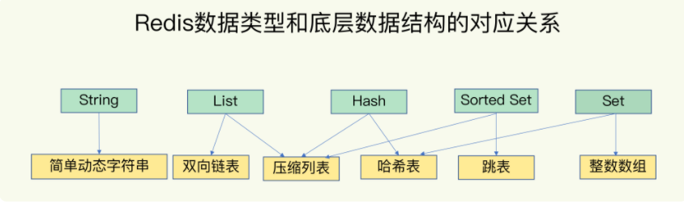
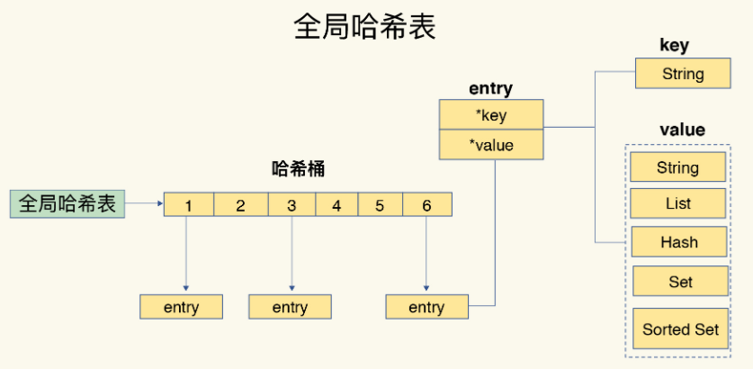
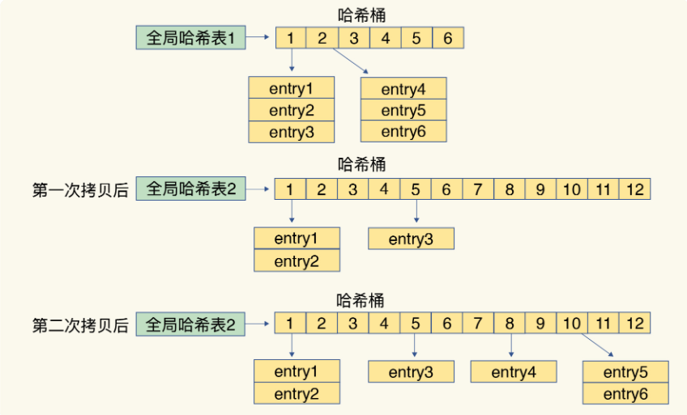
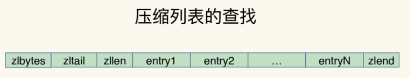
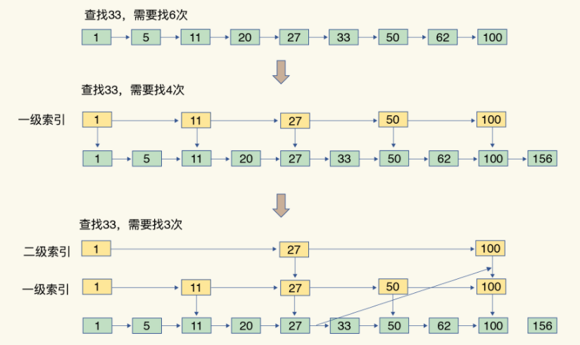

[TOC]

数据库这么多，为啥 Redis 能有这么突出的表现呢？一方面，这是因为它是**内存数据库**，所有操作都在内存上完成，内存的访问速度本身就很快。另一方面，这要归功于它的**数据结构**。这是因为，键值对是按一定的数据结构来组织的，操作键值对最终就是对数据结构进行增删改查操作，所以高效的数据结构是 Redis 快速处理数据的基础。

底层数据结构一共有 6 种，分别是**简单动态字符串**、**双向链表**、**压缩列表**、**哈希表**、**跳表**和**整数数组**。

它们和数据类型的对应关系如下图所示：

`String` 类型的底层实现只有一种数据结构，也就是简单动态字符串。

`List`、`Hash`、`Set` 和 `Sorted Set` 这四种数据类型，都有两种底层实现结构。特点是**一个键对应了一个集合的数据**。

> 问题1. 这些数据结构都是值的底层实现，键和值本身之间用什么结构组织？
>
> 问题2. 为什么集合类型有那么多的底层结构，它们都是怎么组织数据的，都很快吗？
>
> 问题3. 什么是简单动态字符串，和常用的字符串是一回事吗？

###  键和值用什么结构组织？

为了实现从键到值的快速访问，Redis 使用了一个**哈希表**来保存所有键值对。一个哈希表，其实就是一个数组，数组的每个元素称为一个哈希桶

> Q:如果值是集合类型的话，作为数组元素的哈希桶怎么来保存呢？
>
> A:哈希桶中的元素保存的并不是值本身，而是指向具体值的指针。这也就是说，不管值是 String，还是集合类型，哈希桶中的元素都是指向它们的指针。

**潜在的风险点: 哈希表的冲突问题和 rehash 可能带来的操作阻塞。**

哈希冲突 -->  链式哈希  -->  效率降低 --> rehash(增加哈希桶数量)

为了使 `rehash` 操作更高效，`Redis` 默认使用了两个全局哈希表：**哈希表 1** 和**哈希表 2**。

一开始，当你刚插入数据时，默认使用**哈希表 1**，此时的**哈希表 2** 并没有被分配空间。

随着数据逐步增多，Redis 开始执行 `rehash`，这个过程分为三步：

1. 给**哈希表 2** 分配更大的空间，例如是当前**哈希表 1** 大小的两倍；

2. 把**哈希表 1** 中的数据重新映射并拷贝到**哈希表 2** 中；

3. 释放**哈希表 1** 的空间。

到此，我们就可以从 **哈希表 1** 切换到 **哈希表 2**，用增大的 **哈希表 2** 保存更多数据，而原来的**哈希表 1** 留作下一次 `rehash` 扩容备用。

这个过程看似简单，但是第二步涉及大量的数据拷贝，如果一次性把**哈希表 1** 中的数据都迁移完，会造成 **Redis 线程阻塞**，无法服务其他请求。此时，Redis 就无法快速访问数据了。

为了避免这个问题，Redis 采用了 **渐进式 rehash**。

**渐进式 rehash**在第二步拷贝数据时，Redis 仍然正常处理客户端请求，每处理一个请求时，从 **哈希表 1** 中的第一个索引位置开始，顺带着将这个索引位置上的所有 `entries` 拷贝到 **哈希表 2** 中；等处理下一个请求时，再顺带拷贝 **哈希表 1** 中的下一个索引位置的 `entries`。如下图所示

巧妙地把一次性大量拷贝的开销，分摊到了多次处理请求的过程中，避免了耗时操作，保证了数据的快速访问。

###  底层数据结构？

整数数组

双向链表

哈希表

#### 压缩列表

压缩列表实际上类似于一个数组，数组中的每一个元素都对应保存一个数据。

和数组不同的是，压缩列表在表头有三个字段 `zlbytes`、`zltail` 和 `zllen`，分别表示 **列表长度**、**列表尾的偏移量** 和 **列表中的 entry 个数**；压缩列表在表尾还有一个 `zlend`，表示列表结束。

在压缩列表中，如果我们要查找定位第一个元素和最后一个元素，可以通过表头三个字段的长度直接定位，复杂度是 O(1)。而查找其他元素时，就没有这么高效了，只能逐个查找，此时的复杂度就是 O(N) 了。

#### 跳表

跳表在链表的基础上，增加了多级索引，通过索引位置的几个跳转，实现**有序数据**的快速定位

### 不同操作的复杂度

#### 单元素操作是基础

单元素操作，是指每一种集合类型对单个数据实现的增删改查操作。

例如，`Hash` 类型的 `HGET`、`HSET` 和 `HDEL`，`Set` 类型的 `SADD`、`SREM`、`SRANDMEMBER` 等。

这些操作的复杂度由集合采用的数据结构决定，例如，`HGET`、`HSET` 和 `HDEL` 是对哈希表做操作，所以它们的复杂度都是 O(1)；Set 类型用哈希表作为底层数据结构时，它的 `SADD`、`SREM`、`SRANDMEMBER` 复杂度也是 O(1)。

#### 范围操作非常耗时

范围操作，是指集合类型中的遍历操作，可以返回集合中的所有数据，比如 `Hash` 类型的 `HGETALL` 和 `Set` 类型的 `SMEMBERS`，或者返回一个范围内的部分数据，比如 `List` 类型的 `LRANGE` 和 `ZSet` 类型的 `ZRANGE`。这类操作的复杂度一般是 O(N)，比较耗时，我们应该尽量避免。

不过，Redis 从 2.8 版本开始提供了 `SCAN` 系列操作（包括 `HSCAN`，`SSCAN` 和 `ZSCAN`），这类操作实现了**渐进式遍历**，每次只返回有限数量的数据。这样一来，相比于 `HGETALL`、`SMEMBERS` 这类操作来说，就避免了一次性返回所有元素而导致的 Redis 阻塞。

#### 统计操作通常高效

**集合类型对集合中所有元素个数的记录，例如 `LLEN` 和 `SCARD`**

#### 例外情况只有几个

例外情况，是指某些数据结构的特殊记录，例如压缩列表和双向链表都会记录表头和表尾的偏移量。这样一来，对于 List 类型的 `LPOP`、`RPOP`、`LPUSH`、`RPUSH` 这四个操作来说，它们是在列表的头尾增删元素，这就可以通过偏移量直接定位，所以它们的复杂度也只有 O(1)，可以实现快速操作。

