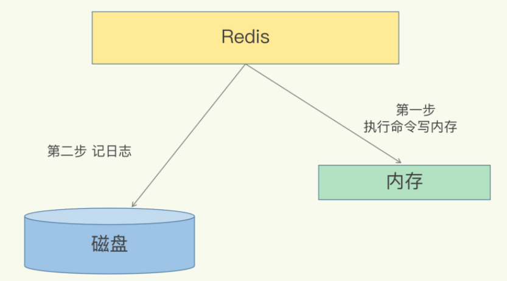
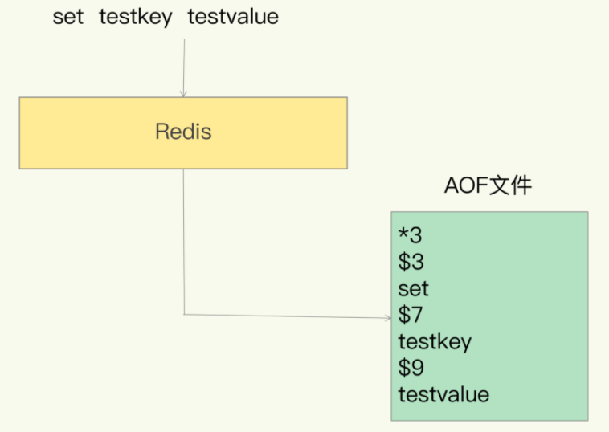
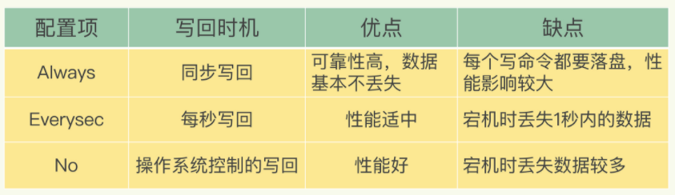
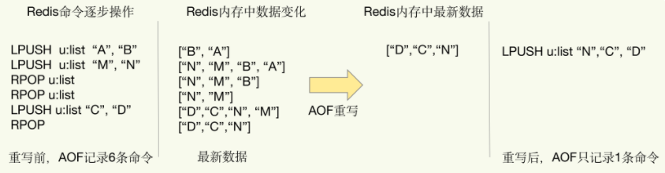
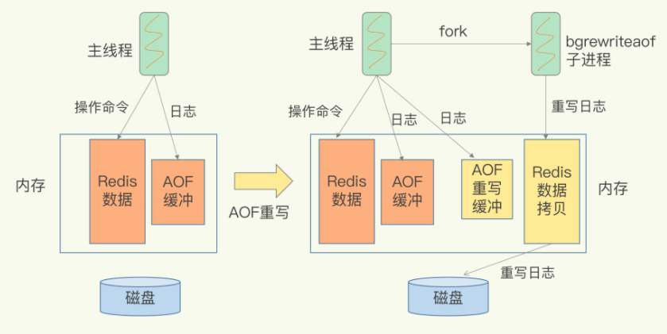

Redis 的持久化主要有两大机制，即 **AOF（Append Only File）日志 **和  **RDB 快照**

## AOF 日志是如何实现的？

数据库的 **写前日志（Write Ahead Log, WAL）**，在实际写数据前，先把修改的数据记到日志文件中，以便故障时进行恢复。

不过，AOF 日志正好相反，它是 **写后日志**，“写后”的意思是 **Redis 是先执行命令，把数据写入内存，然后才记录日志**，如下图所示：

### 那 AOF 为什么要先执行命令再记日志呢？

传统数据库的日志，例如 **redo log（重做日志）**，记录的是修改后的数据，而 AOF 里记录的是 **Redis 收到的每一条命令**，这些命令是以文本形式保存的。

> 以 Redis 收到“set testkey testvalue”命令后记录的日志为例，看看 AOF 日志的内容。
>
> 其中，“*3”表示当前命令有三个部分，每部分都是由“$+数字”开头，后面紧跟着具体的命令、键或值。这里，“数字”表示这部分中的命令、键或值一共有多少字节。例如，“$3 set”表示这部分有 3 个字节，也就是“set”命令。

为了避免额外的检查开销，Redis 在向 AOF 里面记录日志的时候，并不会先去对这些命令进行语法检查。所以，如果先记日志再执行命令的话，日志中就有可能记录了错误的命令，Redis 在使用日志恢复数据时，就可能会出错。而写后日志这种方式，就是先让系统执行命令，只有命令能执行成功，才会被记录到日志中，否则，系统就会直接向客户端报错。

所以，Redis 使用写后日志这一方式的一大好处是，可以 **避免出现记录错误命令** 的情况。AOF 还有一个好处：它是在命令执行后才记录日志，所以**不会阻塞当前的写操作**。

### AOF 也有两个潜在的风险

首先，如果刚执行完一个命令，还没有来得及记日志就宕机了，那么这个命令和相应的数据就有丢失的风险。如果此时 Redis 是用作缓存，还可以从后端数据库重新读入数据进行恢复，但是，如果 Redis 是直接用作数据库的话，此时，因为命令没有记入日志，所以就无法用日志进行恢复了。

其次，AOF 虽然避免了对当前命令的阻塞，但可能会给下一个操作带来阻塞风险。这是因为，AOF 日志也是在主线程中执行的，如果在把日志文件写入磁盘时，磁盘写压力大，就会导致写盘很慢，进而导致后续的操作也无法执行了。

仔细分析的话，你就会发现，这两个风险都是和 **AOF 写回磁盘的时机**相关的。这也就意味着，如果我们能够控制一个写命令执行完后 AOF 日志写回磁盘的时机，这两个风险就解除了。

### 

## 三种写回策略

AOF 机制给我们提供了三个选择，也就是 AOF 配置项 `appendfsync` 的三个可选值。

- **Always**，**同步写回**：每个写命令执行完，立马同步地将日志写回磁盘；不可避免地会影响主线程性能
- **Everysec**，**每秒写回**：每个写命令执行完，只是先把日志写到 AOF 文件的内存缓冲区，每隔一秒把缓冲区中的内容写入磁盘；在避免影响主线程性能和避免数据丢失两者间取了个折中。
- **No**，**操作系统控制的写回**：每个写命令执行完，只是先把日志写到 AOF 文件的内存缓冲区，由操作系统决定何时将缓冲区内容写回磁盘。落盘的时机已经不在 Redis 手中了，只要 AOF 记录没有写回磁盘，一旦宕机对应的数据就丢失了

 

随着接收的写命令越来越多，AOF 文件会越来越大。一定要小心 AOF 文件过大带来的性能问题。

一、文件系统本身对文件大小有限制，无法保存过大的文件

二、如果文件太大，之后再往里面追加命令记录的话，效率也会变低

三、如果发生宕机，AOF 中记录的命令要一个个被重新执行，用于故障恢复，如果日志文件太大，整个恢复过程就会非常缓慢，这就会影响到 Redis 的正常使用。

## 日志文件太大了怎么办？（AOF 重写机制）

重写机制具有“多变一”功能。旧日志文件中的多条命令，在重写后的新日志中变成了一条命令。

`AOF` 文件是以追加的方式，逐一记录接收到的写命令的。当一个键值对被多条写命令反复修改时，AOF 文件会记录相应的多条命令。但是，在重写的时候，是根据这个键值对当前的最新状态，为它生成对应的写入命令。这样一来，一个键值对在重写日志中只用一条命令就行了，而且，在日志恢复时，只用执行这条命令，就可以直接完成这个键值对的写入了。

## AOF 重写会阻塞吗?

和 **AOF 日志由主线程写回** 不同，重写过程是由后台子进程 `bgrewriteaof` 来完成的，这也是为了避免阻塞主线程，导致数据库性能下降。

每次执行重写时，主线程 fork 出后台的 `bgrewriteaof` 子进程。此时，fork 会把主线程的内存拷贝一份给 `bgrewriteaof` 子进程，这里面就包含了数据库的最新数据。然后，`bgrewriteaof` 子进程就可以在不影响主线程的情况下，逐一把拷贝的数据写成操作，记入重写日志。

因为主线程未阻塞，仍然可以处理新来的操作。此时，如果有写操作，Redis 会把这个操作写到它的缓冲区。这样一来，即使宕机了，这个 AOF 日志的操作仍然是齐全的，可以用于恢复。这个操作也会被写到重写日志的缓冲区。这样，重写日志也不会丢失最新的操作。等到拷贝数据的所有操作记录重写完成后，重写日志记录的这些最新操作也会写入新的 AOF 文件，以保证数据库最新状态的记录。此时，我们就可以用新的 AOF 文件替代旧文件了。

每次 AOF 重写时，Redis 会先执行一个内存拷贝，用于重写；然后，使用两个日志保证在重写过程中，新写入的数据不会丢失。而且，因为 Redis 采用额外的线程进行数据重写，所以，这个过程并不会阻塞主线程。

