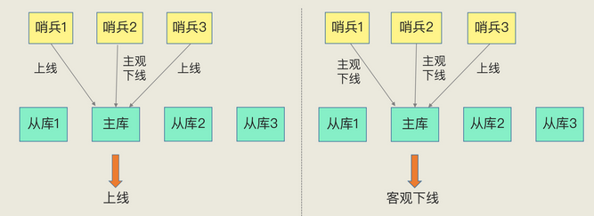
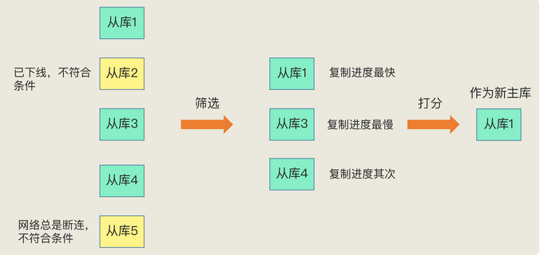
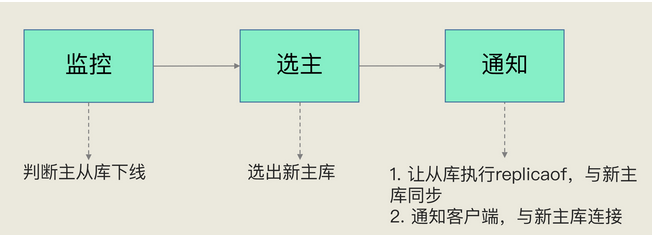

## 哨兵机制的基本流程

哨兵其实就是一个运行在特殊模式下的 Redis 进程，主从库实例运行的同时，它也在运行。

哨兵主要负责的就是三个任务：**监控**、**选主** 和**通知**。

### 监控

监控是指哨兵进程在运行时，周期性地给所有的主从库发送 `PING` 命令，检测它们是否仍然在线运行。

如果**从库**没有在规定时间内响应哨兵的 `PING`  命令，哨兵就会把它标记为“下线状态”；

如果**主库**也没有在规定时间内响应哨兵的 `PING`  命令，哨兵就会判定主库下线，然后开始自动切换主库的流程。

> **哨兵如何判断主库是否处于下线状态?**
>
> 哨兵进程会使用 PING 命令检测它自己和主、从库的网络连接情况，用来判断实例的状态。如果哨兵发现主库或从库对 PING 命令的响应超时了，那么，哨兵就会先把它标记为“**主观下线**”。
>
> 如果检测的是从库，那么，哨兵简单地把它标记为“主观下线”就行了，因为从库的下线影响一般不太大，集群的对外服务不会间断。但是，如果检测的是主库，那么，哨兵还不能简单地把它标记为“主观下线”，开启主从切换。
>
> 因为很有可能存在这么一个情况：那就是哨兵误判了，其实主库并没有故障。要特别注意误判的情况，因为，一旦启动了主从切换，后续的选主和通知操作都会带来额外的计算和通信开销。
>
> 误判一般会发生在集群网络压力较大、网络拥塞，或者是主库本身压力较大的情况下。
>
> 哨兵机制也是类似的，它通常会采用 **多实例组成的集群模式** 进行部署，这也被称为哨兵集群。引入多个哨兵实例一起来判断，就可以避免单个哨兵因为自身网络状况不好，而误判主库下线的情况。同时，多个哨兵的网络同时不稳定的概率较小，由它们一起做决策，误判率也能降低。

当有 N 个哨兵实例时，最好要有 **N/2 + 1** 个实例判断主库为“**主观下线**”，才能最终判定主库为“**客观下线**”

### 选主

主库挂了以后，哨兵就需要从很多个从库里，按照一定的规则选择一个从库实例，把它作为新的主库。这一步完成后，现在的集群里就有了新主库。

> **哨兵如何决定选择哪个从库实例作为主库？**
>
> 多个从库中，先按照一定的筛选条件，把不符合条件的从库去掉。然后，我们再按照一定的规则，给剩下的从库逐个打分，将得分最高的从库选为新主库
>
> 
>
> 第一轮：优先级最高的从库得分高(`slave-priority` 配置项)
>
> 第二轮：和旧主库同步程度最接近的从库得分高。( `slave_repl_offset` 最接近 `master_repl_offset`)
>
> 第三轮：ID 号小的从库得分高。

### 通知

在执行通知任务时，哨兵会把新主库的连接信息发给其他从库，让它们执行 `replicaof` 命令，和新主库建立连接，并进行数据复制。同时，哨兵会把新主库的连接信息通知给客户端，让它们把请求操作发到新主库上。

