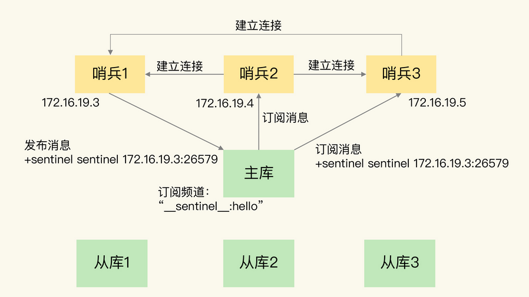
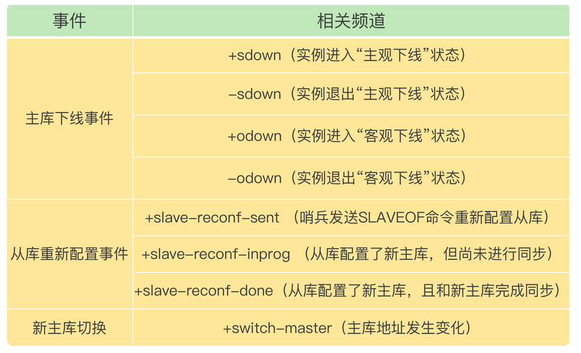
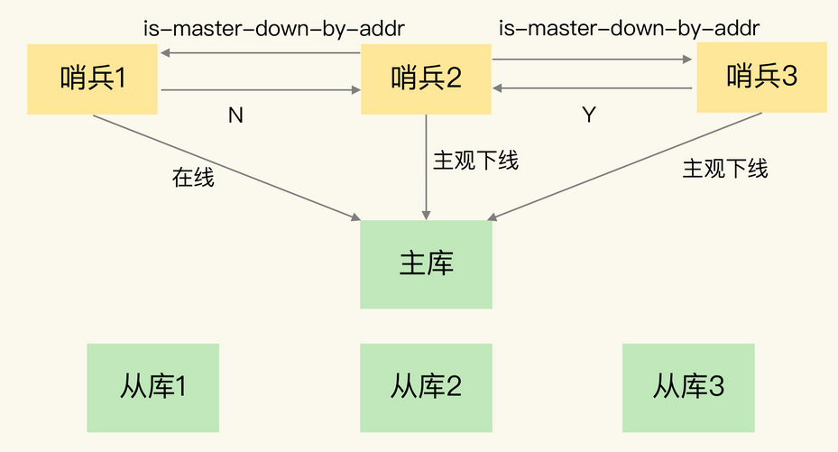
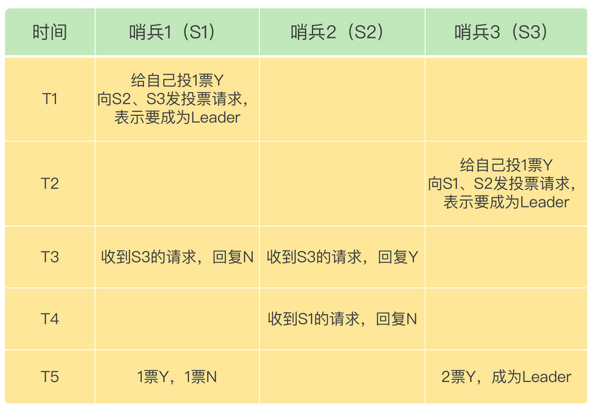

## 基于 pub/sub 机制的哨兵集群组成

哨兵实例之间可以相互发现，要归功于 **Redis 提供的 pub/sub 机制**，也就是 **发布 / 订阅机制**

哨兵只要和主库建立起了连接，就可以在主库上发布消息了，比如说发布它自己的**连接信息**（IP 和端口）。同时，它也可以从主库上订阅消息，获得**其他哨兵发布的连接信息**。当多个哨兵实例都在主库上做了发布和订阅操作后，它们之间就能知道彼此的 IP 地址和端口。

为了区分不同应用的消息，Redis 会以**频道**的形式，对这些消息进行分门别类的管理。只有订阅了同一个频道的应用，才能通过发布的消息进行信息交换。

> 在主从集群中，主库上有一个名为**_ _ sentinel _ _:hello**的频道，不同哨兵就是通过它来相互发现，实现互相通信的。




## 基于 pub/sub 机制的客户端事件通知

客户端可以从哨兵订阅消息。哨兵提供的消息订阅频道有很多，不同频道包含了主从库切换过程中的不同关键事件。



客户端读取哨兵的配置文件后，可以获得哨兵的地址和端口，和哨兵建立网络连接。然后，我们可以在客户端执行 **订阅命令**，来获取不同的事件消息。

```
//订阅“所有实例进入客观下线状态的事件”
SUBSCRIBE +odown

//订阅所有的事件
PSUBSCRIBE  *
```

当哨兵把新主库选择出来后，客户端就会看到下面的 `switch-master` 事件。这个事件表示主库已经切换了，新主库的 IP 地址和端口信息已经有了。这个时候，客户端就可以用这里面的新主库地址和端口进行通信了。

```
switch-master <master name> <oldip> <oldport> <newip> <newport>
```


有了这些事件通知，客户端不仅可以在主从切换后得到新主库的连接信息，还可以监控到主从库切换过程中发生的各个重要事件。这样，客户端就可以知道主从切换进行到哪一步了，有助于了解切换进度。


## 由哪个哨兵执行主从切换？

### 投票下线

任何一个实例只要自身判断主库“主观下线”后，就会给其他实例发送 `is-master-down-by-addr` 命令。接着，其他实例会根据自己和主库的连接情况，做出 Y 或 N 的响应，Y 相当于赞成票，N 相当于反对票。




一个哨兵获得了仲裁所需的赞成票数后，就可以标记主库为“客观下线”。这个所需的赞成票数是通过哨兵配置文件中的 `quorum` 配置项设定的。例如，现在有 5 个哨兵，`quorum` 配置的是 3，那么，一个哨兵需要 3  张赞成票，就可以标记主库为“客观下线”了。这 3 张赞成票包括哨兵自己的一张赞成票和另外两个哨兵的赞成票。


### 投票确认Leader

这个哨兵就可以再给其他哨兵发送命令，表明希望由自己来执行主从切换，并让所有其他哨兵进行投票。这个投票过程称为“**Leader 选举**”。因为最终执行主从切换的哨兵称为 Leader，投票过程就是确定 Leader。

任何一个想成为 Leader  的哨兵，要满足两个条件：第一，拿到半数以上的赞成票；第二，拿到的票数同时还需要大于等于哨兵配置文件中的 quorum 值。以 3  个哨兵为例，假设此时的 quorum 设置为 2，那么，任何一个想成为 Leader 的哨兵只要拿到 2 张赞成票，就可以了。



如果 S3 没有拿到 2 票  Y，那么这轮投票就不会产生 Leader。哨兵集群会等待一段时间（也就是哨兵故障转移超时时间的 2  倍），再重新选举。这是因为，哨兵集群能够进行成功投票，很大程度上依赖于选举命令的正常**网络传播**。如果网络压力较大或有短时堵塞，就可能导致没有一个哨兵能拿到半数以上的赞成票。所以，等到网络拥塞好转之后，再进行投票选举，成功的概率就会增加。

需要注意的是，如果哨兵集群只有 2 个实例，此时，一个哨兵要想成为 Leader，必须获得 2 票，而不是 1  票。所以，如果有个哨兵挂掉了，那么，此时的集群是无法进行主从库切换的。因此，通常我们**至少会配置 3  个哨兵实例**。这一点很重要，你在实际应用时可不能忽略了。