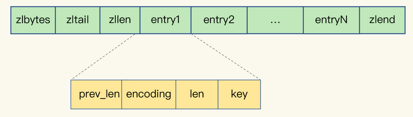

String 类型并不是适用于所有场合的，它有一个明显的短板，就是它 **保存数据时所消耗的内存空间较多**

使用 **二级编码**，实现 **用集合类型保存单键值对**，可以明显降低Redis实例的内存空间消耗


### String 类型的内存空间消耗在哪儿了?

除了记录实际数据，String 类型还需要额外的内存空间记录数据长度、空间使用等元数据信息


> String 类型具体是怎么保存数据的呢？
>
> 保存 64 位有符号整数时，String 类型会把它保存为一个 8 字节的 Long 类型整数，这种保存方式通常也叫作 int 编码方式。
>
> 保存的数据中包含字符时，String 类型就会用简单动态字符串（Simple Dynamic String，SDS）结构体来保存,在 `SDS` 中，`buf` 保存实际数据，而 `len` 和 `alloc` 本身其实是 `SDS` 结构体的额外开销。
>
> - `buf`：字节数组，保存实际数据。为了表示字节数组的结束，Redis 会自动在数组最后加一个“\0”，这就会额外占用 1 个字节的开销。
> - `len`：占 4 个字节，表示 buf 的已用长度。
> - `alloc`：也占个 4  字节，表示 buf 的实际分配长度，一般大于 len。

RedisObject 

全局哈希表

jemalloc 


### 用什么数据结构可以节省内存?

**压缩列表（ziplist）**，这是一种非常节省内存的结构，压缩列表表头有三个字段 `zlbytes`、`zltail` 和 `zllen`，分别表示 **列表长度**、**列表尾的偏移量**，以及 **列表中的 entry 个数**。压缩列表尾还有一个 `zlend`，表示列表结束。

​	

压缩列表之所以能节省内存，就在于它是用一系列 **连续的 entry 保存数据**。

每个 entry 的元数据包括下面几部分。

- `prev_len`，表示前一个 entry  的长度。prev_len 有两种取值情况：1 字节或 5 字节。取值 1 字节时，表示上一个 entry 的长度小于 254 字节。虽然 1  字节的值能表示的数值范围是 0 到 255，但是压缩列表中 zlend 的取值默认是 255，因此，就默认用 255  表示整个压缩列表的结束，其他表示长度的地方就不能再用 255 这个值了。所以，当上一个 entry 长度小于 254 字节时，prev_len  取值为 1 字节，否则，就取值为 5 字节。
- `len`：表示自身长度，4 字节；
- `encoding`：表示编码方式，1  字节；
- `content`：保存实际数据。


### 如何用集合类型保存单值键值对?

采用基于 Hash 类型的二级编码方法。就是把一个单值的数据拆分成两部分，前一部分作为 Hash 集合的 key，后一部分作为 Hash 集合的 value，这样一来，我们就可以把单值数据保存到 Hash 集合中了。

以图片 ID 1101000060  和图片存储对象 ID 3302000080 为例，我们可以把图片 ID 的前 7 位（1101000）作为 **Hash 类型的键**，把图片 ID  的最后 3 位（060）和图片存储对象 ID 分别作为 **Hash 类型值中的 key 和 value**。按照这种设计方法，我在 Redis  中插入了一组图片 ID 及其存储对象 ID 的记录，并且用 info 命令查看了内存开销，我发现，增加一条记录后，内存占用只增加了 16  字节，如下所示：

```bash

127.0.0.1:6379> info memory
# Memory
used_memory:1039120
127.0.0.1:6379> hset 1101000 060 3302000080
(integer) 1
127.0.0.1:6379> info memory
# Memory
used_memory:1039136
```


### Hash 类型底层结构什么时候使用压缩列表，什么时候使用哈希表呢？


Hash  类型设置了用压缩列表保存数据时的两个阈值，一旦超过了阈值，Hash  类型就会用哈希表来保存数据了。

这两个阈值分别对应以下两个配置项：

`hash-max-ziplist-entries`：表示用压缩列表保存时哈希集合中的 **最大元素个数**。

`hash-max-ziplist-value`：表示用压缩列表保存时哈希集合中 **单个元素的最大长度**。

如果我们往 Hash 集合中写入的元素个数超过了 `hash-max-ziplist-entries`，或者写入的单个元素大小超过了 `hash-max-ziplist-value`，Redis  就会自动把 Hash 类型的实现结构由 **压缩列表转为哈希表**。一旦从压缩列表转为了哈希表，Hash  类型就会一直用哈希表进行保存，而不会再转回压缩列表了。在节省内存空间方面，哈希表就没有压缩列表那么高效了。


为了能充分使用压缩列表的精简内存布局，我们一般要 **控制保存在 Hash 集合中的元素个数**。所以，在刚才的二级编码中，我们只用图片 ID 最后 3 位作为 Hash 集合的 key，也就保证了 Hash  集合的元素个数不超过 1000，同时，我们把 hash-max-ziplist-entries 设置为 1000，这样一来，Hash  集合就可以一直使用压缩列表来节省内存空间了。