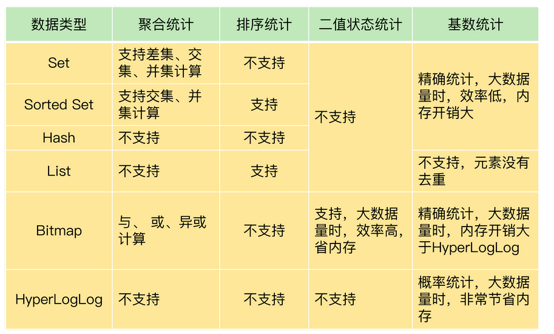

## 聚合统计


所谓的聚合统计，就是指 **统计多个集合元素的聚合结果**，包括：交集统计，差集统计，并集统计

> 统计手机 App 每天的**新增用户数**和第二天的**留存用户数**，正好对应了聚合统计。
>
> 用一个集合记录所有登录过 App 的用户 ID，直接使用 **Set 类型**，把 key 设置为 `user:id`，**表示记录的是用户 ID**，value 就是一个 **Set 集合**，里面是所有登录过 App 的用户 ID，我们可以把这个 Set 叫作**累计用户 Set**
>
> 用另一个集合记录每一天登录过 App 的用户 ID，key 是 user:id 以及当天日期，例如 user：id:20200803，叫做**每日用户 Set**
>
> **在统计每天的新增用户时，我们只用计算每日用户 Set 和累计用户 Set 的差集就行。**


```
// 并集，将每日用户合并到累计用户Set
SUNIONSTORE  user:id  user:id  user:id:20200803 

// 差集，0804新增用户
SDIFFSTORE  user:new  user:id:20200804 user:id  

// 交集，0804留存用户
SINTERSTORE user:id:rem user:id:20200803 user:id:20200804
```


Set  的差集、并集和交集的计算复杂度较高，在数据量较大的情况下，如果直接执行这些计算，会导致 Redis  实例阻塞。所以，我给你分享一个小建议：**你可以从主从集群中选择一个从库，让它专门负责聚合计算，或者是把数据读取到客户端，在客户端来完成聚合统计**，这样就可以规避阻塞主库实例和其他从库实例的风险了。


## 排序统计

`Sorted Set`  根据元素的实际权重来排序和获取数据的。

`Sorted Set` 的 `ZRANGEBYSCORE`  命令就可以按权重排序后返回元素。即使集合中的元素频繁更新，`Sorted Set` 也能通过 `ZRANGEBYSCORE`  命令准确地获取到按序排列的数据

假设越新的评论权重越大，目前最新评论的权重是 N，我们执行下面的命令时，就可以获得最新的 10 条评论：

```
RANGEBYSCORE comments N-9 N
```

所以，在面对需要展示最新列表、排行榜等场景时，如果**数据更新频繁**或者**需要分页显示**，建议你**优先考虑使用 Sorted Set**


## 二值状态统计

二值状态就是指集合元素的取值就 **只有 0 和 1 两种**。在签到打卡的场景中，我们只用记录签到（1）或未签到（0），所以它就是非常典型的二值状态

`Bitmap` 是用 String 类型作为底层数据结构实现的一种统计二值状态的数据类型。String 类型是会保存为二进制的字节数组，所以，Redis 就把字节数组的每个 bit 位利用起来，用来表示一个元素的二值状态。**可以把 `Bitmap` 看作是一个 bit 数组**

`Bitmap` 提供了 `GETBIT/SETBIT` 操作，使用一个偏移值 `offset` 对 bit 数组的某一个 bit 位进行读和写。不过，需要注意的是，Bitmap 的偏移量是从 0  开始算的，也就是说 offset 的最小值是 0。当使用 `SETBIT` 对一个 bit 位进行写操作时，这个 bit 位会被设置为  1。Bitmap 还提供了 `BITCOUNT` 操作，用来统计这个 bit 数组中所有“1”的个数。

> **怎么用 `Bitmap` 进行签到统计呢？**
>
> 假设我们要统计 ID 3000 的用户在 2020 年 8 月份的签到情况，就可以按照下面的步骤进行操作。
>
> ```java
> //第一步，执行下面的命令，记录该用户 8 月 3 号已签到。
> SETBIT uid:sign:3000:202008 2 1 
> 
> //第二步，检查该用户 8 月 3 日是否签到
> GETBIT uid:sign:3000:202008 2 
> 
> //第三步，统计该用户在 8 月份的签到次数。
> BITCOUNT uid:sign:3000:202008
> 
> ```


> **如果记录了 1 亿个用户 10 天的签到情况，你有办法统计出这 10 天连续签到的用户总数吗？**
>
> `Bitmap` 支持用 `BITOP` 命令对多个 `Bitmap` 按位做“与”“或”“异或”的操作，操作的结果会保存到一个新的 `Bitmap` 中。
>
> 在统计 1 亿个用户连续 10  天的签到情况时，可以把每天的日期作为 key，每个 key 对应一个 1 亿位的 Bitmap，每一个 bit  对应一个用户当天的签到情况。
>
> 接下来，我们对 10 个 Bitmap 做“与”操作，得到的结果也是一个 Bitmap。在这个 Bitmap  中，只有 10 天都签到的用户对应的 bit 位上的值才会是 1。
>
> 最后，我们可以用 BITCOUNT 统计下 Bitmap 中的 1  的个数，这就是连续签到 10 天的用户总数了。
>
> 现在，我们可以计算一下记录了 10 天签到情况后的内存开销。每天使用 1 个 1 亿位的  Bitmap，大约占 12MB 的内存（10^8/8/1024/1024），10 天的 Bitmap 的内存开销约为  120MB，内存压力不算太大。不过，在实际应用时，最好对 Bitmap 设置过期时间，让 Redis  自动删除不再需要的签到记录，以节省内存开销。


## 基数统计

基数统计就是指 统计一个集合中**不重复的元素个数**。

网页 UV 的统计有个独特的地方，就是需要**去重**，一个用户一天内的多次访问只能算作一次。在 Redis 的集合类型中，**Set 类型**默认支持去重，所以看到有去重需求时，我们可能第一时间就会想到用 Set 类型。如果 page 非常火爆，UV 达到了千万，这个时候，一个 Set 就要记录千万个用户 ID。对于一个搞大促的电商网站而言，这样的页面可能有成千上万个，如果每个页面都用这样的一个 Set，就会消耗很大的内存空间。

`HyperLogLog` 是一种用于统计基数的数据集合类型，它的最大优势就在于，**当集合元素数量非常多时，它计算基数所需的空间总是固定的，而且还很小**

在 Redis 中，每个 `HyperLogLog` 只需要花费 12 KB 内存，就可以计算接近 2^64 个元素的基数。和元素越多就越耗费内存的 Set 和 Hash 类型相比，`HyperLogLog` 就非常节省空间。

`HyperLogLog`  的统计规则是基于概率完成的，所以它给出的统计结果是有一定误差的，标准误算率是 0.81%。这也就意味着，你使用 HyperLogLog 统计的  UV 是 100 万，但实际的 UV 可能是 101 万。虽然误差率不算大，但是，如果你需要精确统计结果的话，最好还是继续用 Set 或  Hash 类型。

