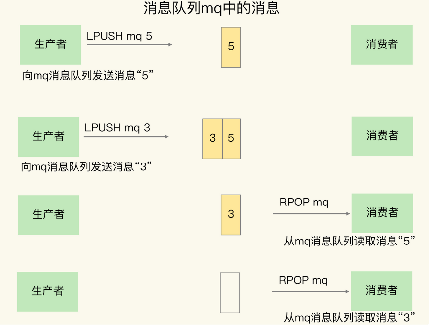
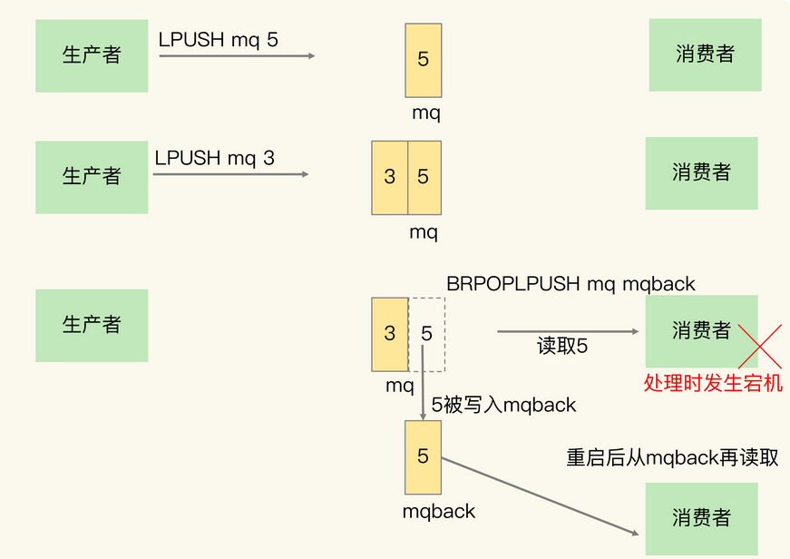
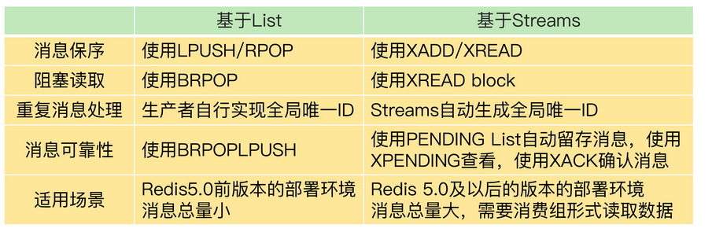

[TOC]


## 消息队列的消息存取需求

消息队列在存取消息时，必须要满足三个需求，分别是 **消息保序**、**处理重复的消息** 和 **保证消息可靠性**。

Redis 的 List 和 Streams 两种数据类型，就可以满足消息队列的这三个需求。

### 基于 List 的消息队列解决方案

#### 消息保序

生产者可以使用 `LPUSH` 命令把要发送的消息依次写入 List，而消费者则可以使用 `RPOP` 命令，从 List 的另一端按照消息的写入顺序，依次读取消息并进行处理。




如果没有新消息写入 List，消费者也要不停地调用  `RPOP` 命令，这就会导致消费者程序的 CPU 一直消耗在执行 `RPOP` 命令上，带来不必要的性能损失。为了解决这个问题，Redis 提供了  `BRPOP` 命令。`BRPOP`  命令也称为**阻塞式读取**，客户端在没有读到队列数据时，自动阻塞，直到有新的数据写入队列，再开始读取新数据。和消费者程序自己不停地调用 `RPOP`  命令相比，这种方式能节省 CPU 开销。


#### 重复消息处理

消费者程序本身能对重复消息进行判断。消息队列要能给每一个消息提供全局唯一的 ID 号，消费者程序要把已经处理过的消息的 ID 号记录下来。

> 幂等性就是指，对于同一条消息，消费者收到一次的处理结果和收到多次的处理结果是一致的。

消息的全局唯一 ID 号就需要生产者程序在发送消息前自行生成。生成之后，我们在用 `LPUSH` 命令把消息插入 List 时，需要在消息中包含这个全局唯一 ID。

```
LPUSH mq "101030001:stock:5"
(integer) 1
```

#### 消息可靠性

为了留存消息，List 类型提供了  `BRPOPLPUSH` 命令，这个命令的作用是让消费者程序从一个 List 中读取消息，同时，Redis 会把这个消息再插入到另一个  List（可以叫作 **备份 List**）留存。这样一来，如果消费者程序读了消息但没能正常处理，等它重启后，就可以从备份 List  中重新读取消息并进行处理了。




### 基于 Streams 的消息队列解决方案

Streams 是 Redis  专门为消息队列设计的数据类型，它提供了丰富的消息队列操作命令。

- `XADD`：插入消息，保证有序，可以自动生成全局唯一  ID；
- `XREAD`：用于读取消息，可以按 ID 读取数据；
- `XREADGROUP`：按消费组形式读取消息；
- `XPENDING` 和  `XACK`：`XPENDING` 命令可以用来查询每个消费组内所有消费者已读取但尚未确认的消息，而 `XACK` 命令用于向消息队列确认消息处理已完成。


### List和Streams实现消息队列的特点和区别

