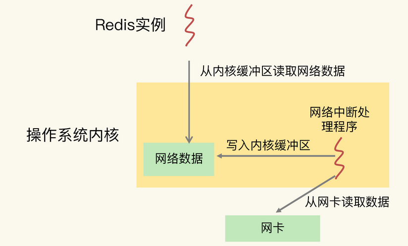

CPU 的多核架构以及多 CPU 架构，也会影响到 Redis 的性能。

## 主流的 CPU 架构

一个 CPU  处理器中一般有多个运行核心，我们把一个运行核心称为一个 **物理核**，每个物理核都可以运行应用程序。每个物理核都拥有私有的**一级缓存**（`Level 1  cache`，简称 L1 cache），包括一级指令缓存和一级数据缓存，以及私有的**二级缓存**（`Level 2 cache`，简称 L2 cache）。

**物理核的私有缓存：指缓存空间只能被当前的这个物理核使用，其他的物理核无法对这个核的缓存空间进行数据存取。**

因为 L1 和 L2 缓存是每个物理核私有的，所以，当数据或指令保存在 L1、L2 缓存时，物理核访问它们的延迟不超过 10 纳秒，速度非常快。那么，如果 Redis 把要运行的指令或存取的数据保存在 L1 和 L2 缓存的话，就能高速地访问这些指令和数据，但是，这些 L1 和 L2  缓存的大小受限于处理器的制造技术，一般只有 KB 级别，存不下太多的数据。如果 L1、L2  缓存中没有所需的数据，应用程序就需要访问内存来获取数据。而应用程序的访存延迟一般在百纳秒级别，是访问 L1、L2 缓存的延迟的近 10  倍，不可避免地会对性能造成影响。

不同的物理核还会共享一个共同的**三级缓存**（`Level 3 cache`，简称为 L3 cache）。L3 缓存能够使用的存储资源比较多，所以一般比较大，能达到几 MB 到几十  MB，这就能让应用程序缓存更多的数据。当 L1、L2 缓存中没有数据缓存时，可以访问 L3，尽可能避免访问内存。

现在主流的 CPU 处理器中，每个物理核通常都会运行两个**超线程**，也叫作 **逻辑核**。同一个物理核的逻辑核会共享使用 L1、L2 缓存。


在主流的服务器上，一个 CPU 处理器会有 10 到 20 多个物理核。同时，为了提升服务器的处理能力，服务器上通常还会有多个 CPU 处理器（也称为多 CPU  Socket），每个处理器有自己的物理核（包括 L1、L2 缓存），L3 缓存，以及连接的内存，同时，不同处理器间通过总线连接。在多 CPU 架构上，应用程序可以在不同的处理器上运行。Redis 可以先在 Socket  1 上运行一段时间，然后再被调度到 Socket  2 上运行。

如果应用程序先在一个 Socket  上运行，并且把数据保存到了内存，然后被调度到另一个 Socket 上运行，此时，应用程序再进行内存访问时，就需要访问之前 Socket  上连接的内存，这种访问属于 **远端内存访问**。和访问 Socket 直接连接的内存相比，远端内存访问会增加应用程序的延迟。

在多 CPU 架构下，一个应用程序访问所在 Socket 的本地内存和访问远端内存的延迟并不一致，所以，我们也把这个架构称为 **非统一内存访问架构**（Non-Uniform Memory Access，NUMA 架构）


## CPU 多核对 Redis 性能的影响

在一个 CPU  核上运行时，应用程序需要记录自身使用的 **软硬件资源信息（例如栈指针、CPU  核的寄存器值等）**，我们把这些信息称为**运行时信息**。同时，应用程序访问最频繁的指令和数据还会被缓存到 L1、L2  缓存上，以便提升执行速度。但是，在多核 CPU 的场景下，一旦应用程序需要在一个新的 CPU 核上运行，那么，运行时信息就需要重新加载到新的  CPU 核上。而且，新的 CPU 核的 L1、L2 缓存也需要重新加载数据和指令，这会导致程序的运行时间增加。

> 项目需求是要对 Redis 的 99% 尾延迟进行优化，要求 GET 尾延迟小于 300 微秒，PUT 尾延迟小于 500 微秒。
>
> 我们仔细检测了 Redis 实例运行时的服务器  CPU 的状态指标值，
>
> 发现 CPU 的 `context switch` 次数比较多。`context switch`  是指**线程的上下文切换**，这里的上下文就是线程的运行时信息。在 CPU 多核的环境中，一个线程先在一个 CPU 核上运行，之后又切换到另一个 CPU 核上运行，这时就会发生 context switch。

要避免 Redis 总是在不同 CPU 核上来回调度执行。于是，我们尝试着把 Redis 实例和 CPU 核绑定了，让一个 Redis 实例固定运行在一个 CPU 核上。我们可以使用 `taskset` 命令把一个程序绑定在一个核上运行。

```bash
//-c 选项用于设置要绑定的核编号。
taskset -c 0 ./redis-server
```


## CPU 的 NUMA 架构对 Redis 性能的影响

在实际应用 Redis  时，我经常看到一种做法，为了提升 Redis 的网络性能，**把操作系统的网络中断处理程序和 CPU  核绑定**。这个做法可以避免网络中断处理程序在不同核上来回调度执行，的确能有效提升 Redis 的网络处理性能。

但是，网络中断程序是要和 Redis 实例进行网络数据交互的，一旦把网络中断程序绑核后，我们就需要注意 Redis 实例是绑在哪个核上了，这会关系到 Redis  访问网络数据的效率高低。

我们先来看下 **Redis  实例和网络中断程序的数据交互**：网络中断处理程序从网卡硬件中读取数据，并把数据写入到操作系统内核维护的一块内存缓冲区。内核会通过 `epoll`  机制触发事件，通知 Redis 实例，Redis 实例再把数据从内核的内存缓冲区拷贝到自己的内存空间，如下图所示：



如果网络中断处理程序和 Redis 实例各自所绑的 CPU 核不在同一个 CPU Socket 上，那么，Redis 实例读取网络数据时，就需要跨 CPU Socket 访问内存，这个过程会花费较多时间。为了避免 Redis 跨 CPU Socket 访问网络数据，我们最好把网络中断程序和 Redis 实例绑在同一个 CPU Socket 上，这样一来，Redis 实例就可以直接从本地内存读取网络数据了

## 绑核的风险和解决方案

当我们把 Redis 实例绑到一个 CPU 逻辑核上时，就会导致 **子进程**、**后台线程** 和 **Redis 主线程** 竞争 CPU 资源，一旦子进程或后台线程占用 CPU 时，主线程就会被阻塞，导致 Redis 请求延迟增加。

### 方案一：一个 Redis 实例对应绑一个物理核

和只绑一个逻辑核相比，把 Redis  实例和物理核绑定，可以让主线程、子进程、后台线程共享使用 2 个逻辑核，可以在一定程度上缓解 CPU 资源竞争。但是，因为只用了 2  个逻辑核，它们相互之间的 CPU 竞争仍然还会存在。如果你还想进一步减少 CPU 竞争，我再给你介绍一种方案。

### 方案二：优化 Redis 源码

通过修改 Redis 源码，把子进程和后台线程绑到不同的 CPU 核上。

