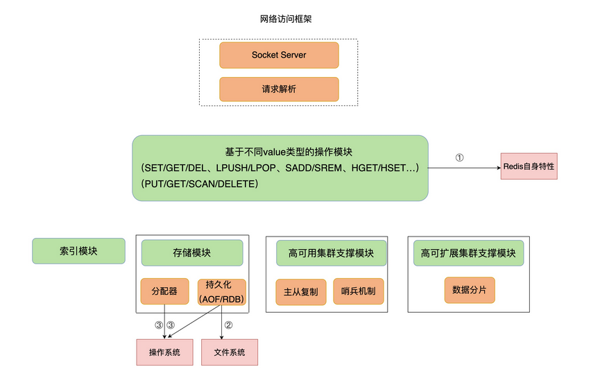

[TOC]

## Redis 真的变慢了吗？

查看 Redis 的响应延迟，当前环境下的 Redis 基线性能

从 2.8.7 版本开始，`redis-cli`  命令提供了`–intrinsic-latency` 选项，可以用来**监测和统计测试期间内的最大延迟**，这个延迟可以作为 Redis  的基线性能。其中，测试时长可以用 `–intrinsic-latency` 选项的参数来指定。

```bash
// 举个例子，比如说，我们运行下面的命令，该命令会打印 120 秒内监测到的最大延迟。

./redis-cli --intrinsic-latency 120
Max latency so far: 17 microseconds.
Max latency so far: 44 microseconds.
Max latency so far: 94 microseconds.
Max latency so far: 110 microseconds.
Max latency so far: 119 microseconds.

36481658 total runs (avg latency: 3.2893 microseconds / 3289.32 nanoseconds per run).
Worst run took 36x longer than the average latency.

// 可以看到，这里的最大延迟是 119 微秒，也就是基线性能为 119 微秒。
// 一般情况下，运行 120 秒就足够监测到最大延迟了，所以，我们可以把参数设置为 120。
```


你要把运行时延迟和基线性能进行对比，如果你观察到的 Redis 运行时延迟是其基线性能的 2 倍及以上，就可以认定 Redis 变慢了。

判断基线性能这一点，对于在虚拟化环境下运行的  Redis  来说，非常重要。这是因为，在虚拟化环境（例如虚拟机或容器）中，由于增加了虚拟化软件层，与物理机相比，虚拟机或容器本身就会引入一定的性能开销，所以基线性能会高一些。

下面的测试结果，显示的就是某一个虚拟机上运行 Redis 时测的基线性能。

```bash
$ ./redis-cli --intrinsic-latency 120
Max latency so far: 692 microseconds.
Max latency so far: 915 microseconds.
Max latency so far: 2193 microseconds.
Max latency so far: 9343 microseconds.
Max latency so far: 9871 microseconds.
```

可以看到，由于虚拟化软件本身的开销，此时的基线性能已经达到了 9.871ms。如果该 Redis 实例的运行时延迟为 10ms，这并不能算作性能变慢，因为此时，运行时延迟只比基线性能增加了  1.3%。如果你不了解基线性能，一看到较高的运行时延迟，就很有可能误判 Redis 变慢了。

不过，我们通常是通过客户端和网络访问 Redis  服务，为了避免网络对基线性能的影响，刚刚说的这个命令需要在服务器端直接运行，这也就是说，我们只考虑服务器端软硬件环境的影响。

如果你想了解网络对  Redis 性能的影响，一个简单的方法是用 `iPerf` 这样的工具，测量从 Redis  客户端到服务器端的网络延迟。如果这个延迟有几十毫秒甚至是几百毫秒，就说明，Redis  运行的网络环境中很可能有大流量的其他应用程序在运行，导致网络拥塞了。这个时候，你就需要协调网络运维，调整网络的流量分配了。

## 如何应对 Redis 变慢？

图上新增的红色模块，就是 Redis 自身的操作特性、文件系统和操作系统，它们是影响 Redis 性能的三大要素。




### Redis 自身操作特性的影响

Redis 提供的键值对命令操作对延迟性能的影响，重点介绍两类关键操作：**慢查询命令 **和 **过期 key 操作**

#### 慢查询命令

Redis 的不同命令的复杂度：[Redis官方文档](https://redis.io/commands)，中对每个命令的复杂度都有介绍，当你需要了解某个命令的复杂度时，可以直接查询。

当你发现 Redis 性能变慢时，可以通过 Redis 日志，或者是 `latency monitor` 工具，查询变慢的请求，根据请求对应的具体命令以及官方文档，确认下是否采用了复杂度高的慢查询命令。

如果的确有大量的慢查询命令，有两种处理方式：

1. **用其他高效命令代替**。比如说，如果你需要返回一个 `SET` 中的所有成员时，不要使用 `SMEMBERS` 命令，而是要使用 `SSCAN`  多次迭代返回，避免一次返回大量数据，造成线程阻塞。
2. 当你需要执行排序、交集、并集操作时，可以在客户端完成，而不要用  `SORT`、`SUNION`、`SINTER` 这些命令，以免拖慢 Redis 实例。
3. 容易忽略的慢查询命令，就是 `KEYS`。它用于返回和输入模式匹配的所有  key， KEYS 命令需要遍历存储的键值对，操作延时高。如果你不了解它的实现而使用了它，就会导致 Redis 性能变慢。所以，**KEYS 命令一般不被建议用于生产环境中**。


#### 过期 key 操作

过期 key  的自动删除机制，是 Redis 用来回收内存空间的常用机制，应用广泛，本身就会引起 Redis  操作阻塞，导致性能变慢，所以，你必须要知道该机制对性能的影响。

Redis 键值对的 key 可以设置过期时间。默认情况下，Redis 每 100 毫秒会删除一些过期 key，具体的算法如下：

1. 采样 `ACTIVE_EXPIRE_CYCLE_LOOKUPS_PER_LOOP` 个数的  key，并将其中过期的 key 全部删除；
2. 如果超过 25% 的 key 过期了，则重复删除的过程，直到过期 key 的比例降至 25%  以下。 

`ACTIVE_EXPIRE_CYCLE_LOOKUPS_PER_LOOP` 是 Redis 的一个参数，默认是 20，那么，一秒内基本有  200 个过期 key 会被删除。这一策略对清除过期 key、释放内存空间很有帮助。如果每秒钟删除 200 个过期 key，并不会对 Redis 造成太大影响。

但是，如果触发了上面这个算法的第二条，Redis 就会一直删除以释放内存空间。**注意，删除操作是阻塞的（Redis 4.0  后可以用异步线程机制来减少阻塞影响）**。所以，一旦该条件触发，Redis  的线程就会一直执行删除，这样一来，就没办法正常服务其他的键值操作了，就会进一步引起其他键值操作的延迟增加，Redis  就会变慢。

那么，算法的第二条是怎么被触发的呢？

其中一个重要来源，就是**频繁使用带有相同时间参数的 `EXPIREAT` 命令设置过期  key**，这就会导致，在同一秒内有大量的 key 同时过期。现在，我就要给出第二条排查建议和解决方法了。你要检查业务代码在使用 `EXPIREAT`  命令设置 key 过期时间时，是否使用了相同的 UNIX 时间戳，有没有使用 `EXPIRE` 命令给批量的 key  设置相同的过期秒数。因为，这都会造成大量 key  在同一时间过期，导致性能变慢。

遇到这种情况时，千万不要嫌麻烦，你首先要根据实际业务的使用需求，决定 `EXPIREAT` 和 `EXPIRE`  的过期时间参数。其次，如果一批 key 的确是同时过期，你还可以在 `EXPIREAT` 和 `EXPIRE`  的过期时间参数上，加上一个一定大小范围内的随机数，这样，既保证了 key 在一个邻近时间范围内被删除，又避免了同时过期造成的压力。


