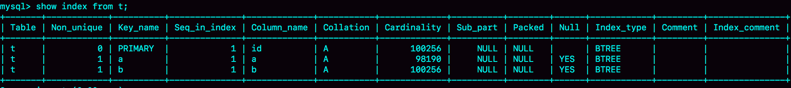
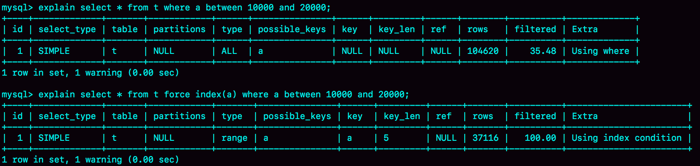
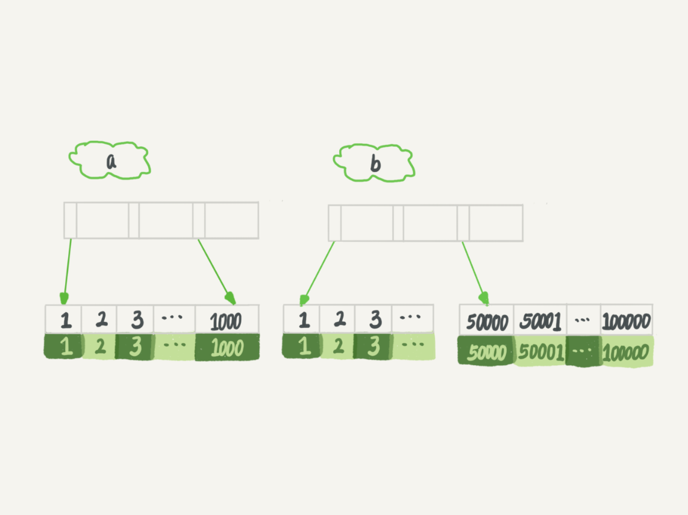
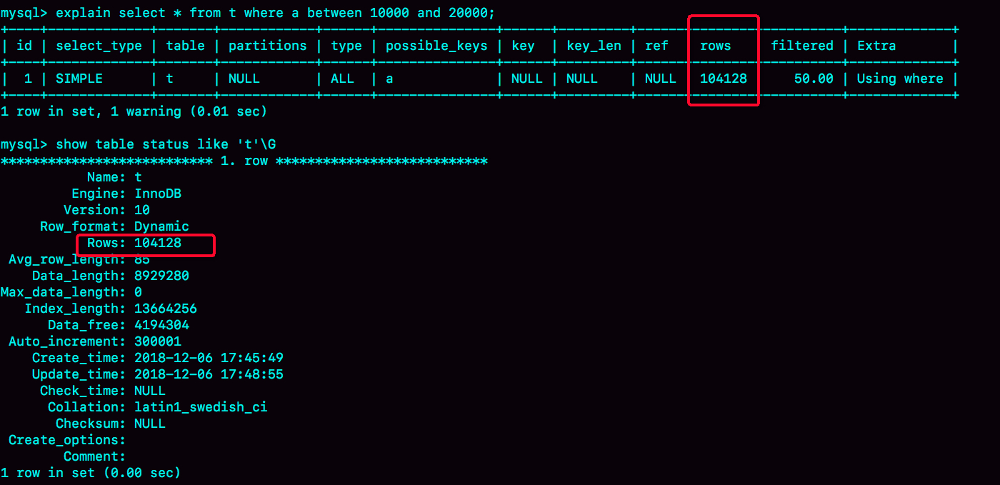

**使用哪个索引是由MySQL来确定的**

不知道你有没有碰到过这种情况，一条本来可以执行得很快的语句，却由于MySQL选错了索引，而导致执行速度变得很慢？

我们一起来看一个例子吧。

我们先建一个简单的表，表里有a、b两个字段，并分别建上索引：

```sql
CREATE TABLE `t` (
  `id` int(11) NOT NULL,
  `a` int(11) DEFAULT NULL,
  `b` int(11) DEFAULT NULL,
  PRIMARY KEY (`id`),
  KEY `a` (`a`),
  KEY `b` (`b`)
) ENGINE=InnoDB；
```

然后，我们往表t中插入10万行记录，取值按整数递增，即：(1,1,1)，(2,2,2)，(3,3,3) 直到(100000,100000,100000)。

我是用存储过程来插入数据的，这里我贴出来方便你复现：

```sql
delimiter ;;
create procedure idata()
begin
  declare i int;
  set i=1;
  while(i<=100000)do
    insert into t values(i, i, i);
    set i=i+1;
  end while;
end;;
delimiter ;
call idata();
```

接下来，我们分析一条SQL语句：

```sql
mysql> select * from t where a between 10000 and 20000;
```


你一定会说，这个语句还用分析吗，很简单呀，a上有索引，肯定是要使用索引a的。你说得没错，图1显示的就是使用explain命令看到的这条语句的执行情况。这条查询语句的执行也确实符合预期，key这个字段值是’a’，表示优化器选择了索引a。


不过别急，这个案例不会这么简单。在我们已经准备好的包含了10万行数据的表上，我们再做如下操作。


session A的操作你已经很熟悉了，它就是开启了一个事务。随后，session B 把数据都删除后，又调用了 idata这个存储过程，插入了10万行数据。这时候，session B的查询语句 `select * from t where a between 10000 and 20000` 就不会再选择索引a了。我们可以通过慢查询日志（slow log）来查看一下具体的执行情况。

为了说明优化器选择的结果是否正确，我增加了一个对照，即：使用 `force index(a)` 来让优化器强制使用索引a（这部分内容，我还会在这篇文章的后半部分中提到）。

下面的三条SQL语句，就是这个实验过程。

```sql
set long_query_time=0;
select * from t where a between 10000 and 20000; /*Q1*/
select * from t force index(a) where a between 10000 and 20000;/*Q2*/
```

- 第一句，是将慢查询日志的阈值设置为0，表示这个线程接下来的语句都会被记录入慢查询日志中；
- 第二句，Q1 是session B原来的查询；
- 第三句，Q2 是加了force index(a)来和 session B原来的查询语句执行情况对比。

如图所示是这三条SQL语句执行完成后的慢查询日志。


可以看到，Q1扫描了10万行，显然是走了全表扫描，执行时间是40毫秒。Q2扫描了10001行，执行了21毫秒。也就是说，我们在没有使用force index的时候，MySQL用错了索引，导致了更长的执行时间。

这个例子对应的是我们平常不断地删除历史数据和新增数据的场景。这时，MySQL竟然会选错索引，是不是有点奇怪呢？今天，我们就从这个奇怪的结果说起吧。 

### **优化器的逻辑**

选择索引是优化器的工作。而优化器选择索引的目的，是找到一个最优的执行方案，并用最小的代价去执行语句。

在数据库里面，扫描行数是影响执行代价的因素之一。扫描的行数越少，意味着访问磁盘数据的次数越少，消耗的CPU资源越少。

当然，扫描行数并不是唯一的判断标准，优化器还会结合是否使用临时表、是否排序等因素进行综合判断。


**扫描行数是怎么判断的？**

MySQL在真正开始执行语句之前，并不能精确地知道满足这个条件的记录有多少条，而只能根据统计信息来估算记录数。这个统计信息就是索引的“**区分度**”。

显然，一个索引上不同的值越多，这个索引的区分度就越好。而一个索引上不同的值的个数，我们称之为“基数”（`cardinality`）。也就是说，这个基数越大，索引的区分度越好。我们可以使用`show index`方法，看到一个索引的基数。

如图所示，就是表t的show index 的结果 。虽然这个表的每一行的三个字段值都是一样的，但是在统计信息中，这三个索引的基数值并不同，而且其实都不准确。



**MySQL是怎样得到索引的基数的呢？**

把整张表取出来一行行统计，虽然可以得到精确的结果，但是代价太高了，所以只能选择“采样统计”。

采样统计的时候，InnoDB默认会选择N个数据页，统计这些页面上的不同值，得到一个平均值，然后乘以这个索引的页面数，就得到了这个索引的基数。而数据表是会持续更新的，索引统计信息也不会固定不变。所以，当变更的数据行数超过1/M的时候，会自动触发重新做一次索引统计。

在MySQL中，有两种存储索引统计的方式，可以通过设置参数 `innodb_stats_persistent` 的值来选择：

- 设置为on的时候，表示统计信息会持久化存储。这时，默认的N是20，M是10。
- 设置为off的时候，表示统计信息只存储在内存中。这时，默认的N是8，M是16。

由于是采样统计，所以不管N是20还是8，这个基数都是很容易不准的。索引统计值（cardinality列）虽然不够精确，但大体上还是差不多的，选错索引一定还有别的原因。其实索引统计只是一个输入，对于一个具体的语句来说，优化器还要判断，执行这个语句本身要扫描多少行。

接下来，我们再一起看看优化器预估的，这两个语句的扫描行数是多少。



rows这个字段表示的是预计扫描行数。其中，Q1的结果还是符合预期的，rows的值是104620；但是Q2的rows值是37116，偏差就大了。而图1中我们用explain命令看到的rows是只有10001行，是这个偏差误导了优化器的判断。

优化器为什么放着扫描37000行的执行计划不用，却选择了扫描行数是100000的执行计划呢？

这是因为，如果使用索引a，每次从索引a上拿到一个值，都要回到主键索引上查出整行数据，这个代价优化器也要算进去的。而如果选择扫描10万行，是直接在主键索引上扫描的，没有额外的代价。

优化器会估算这两个选择的代价，从结果看来，优化器认为直接扫描主键索引更快。当然，从执行时间看来，这个选择并不是最优的。使用普通索引需要把回表的代价算进去，在图1执行explain的时候，也考虑了这个策略的代价 ，但图1的选择是对的。也就是说，这个策略并没有问题。

既然是统计信息不对，那就修正。analyze table t 命令，可以用来重新统计索引信息。我们来看一下执行效果。


所以在实践中，如果你发现explain的结果预估的rows值跟实际情况差距比较大，可以采用这个方法来处理。其实，如果只是索引统计不准确，通过analyze命令可以解决很多问题，但是前面我们说了，优化器可不止是看扫描行数。

`select * from t where (a between 1 and 1000)  and (b between 50000 and 100000) order by b limit 1;`

从条件上看，这个查询没有符合条件的记录，因此会返回空集合。在开始执行这条语句之前，你可以先设想一下，如果你来选择索引，会选择哪一个呢？为了便于分析，我们先来看一下a、b这两个索引的结构图。



如果使用索引a进行查询，那么就是扫描索引a的前1000个值，然后取到对应的id，再到主键索引上去查出每一行，然后根据字段b来过滤。显然这样需要扫描1000行。

如果使用索引b进行查询，那么就是扫描索引b的最后50001个值，与上面的执行过程相同，也是需要回到主键索引上取值再判断，所以需要扫描50001行。

所以你一定会想，如果使用索引a的话，执行速度明显会快很多。那么，下面我们就来看看到底是不是这么一回事儿。执行explain的结果如下图


可以看到，返回结果中key字段显示，这次优化器选择了索引b，而rows字段显示需要扫描的行数是50198。从这个结果中，你可以得到两个结论：扫描行数的估计值依然不准确；这个例子里MySQL又选错了索引。

**索引选择异常和处理**

其实大多数时候优化器都能找到正确的索引，但偶尔你还是会碰到我们上面举例的这两种情况：原本可以执行得很快的SQL语句，执行速度却比你预期的慢很多，你应该怎么办呢？

**第一种方法是，像我们第一个例子一样，采用force index强行选择一个索引。**

**第二种方法是，我们可以考虑修改语句，引导MySQL使用我们期望的索引****。**

**第三种方法是，在有些场景下，我们可以新建一个更合适的索引，来提供给优化器做选择，或删掉误用的索引。**

### **小结**

今天我们一起聊了聊索引统计的更新机制，并提到了优化器存在选错索引的可能性。

对于由于索引统计信息不准确导致的问题，你可以用analyze table来解决。

而对于其他优化器误判的情况，你可以在应用端用force index来强行指定索引，也可以通过修改语句来引导优化器，还可以通过增加或者删除索引来绕过这个问题。

### **思考题**

前面我们在构造第一个例子的过程中，通过session A的配合，让session B删除数据后又重新插入了一遍数据，然后就发现explain结果中，rows字段从10001变成37000多。

而如果没有session A的配合，只是单独执行delete from t 、call idata()、explain这三句话，会看到rows字段其实还是10000左右。你可以自己验证一下这个结果。

这是什么原因呢？也请你分析一下吧。

delete 语句删掉了所有的数据，然后再通过call idata()插入了10万行数据，看上去是覆盖了原来的10万行。但是，session A开启了事务并没有提交，所以之前插入的10万行数据是不能删除的。这样，之前的数据每一行数据都有两个版本，旧版本是delete之前的数据，新版本是标记为deleted的数据。

这样，索引a上的数据其实就有两份。然后你会说，不对啊，主键上的数据也不能删，那没有使用force index的语句，使用explain命令看到的扫描行数为什么还是100000左右？（潜台词，如果这个也翻倍，也许优化器还会认为选字段a作为索引更合适）

是的，不过这个是主键，主键是直接按照表的行数来估计的。而表的行数，优化器直接用的是show table status的值。

这个值的计算方法，我会在后面有文章为你详细讲解。

