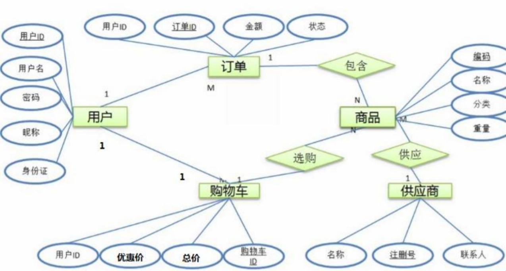
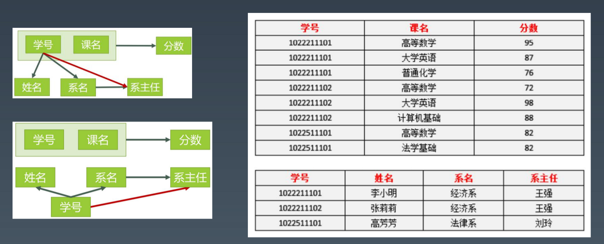
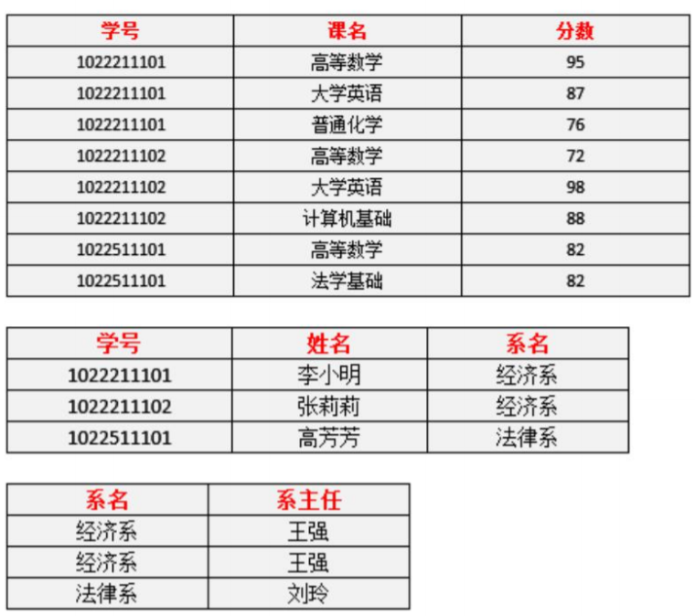
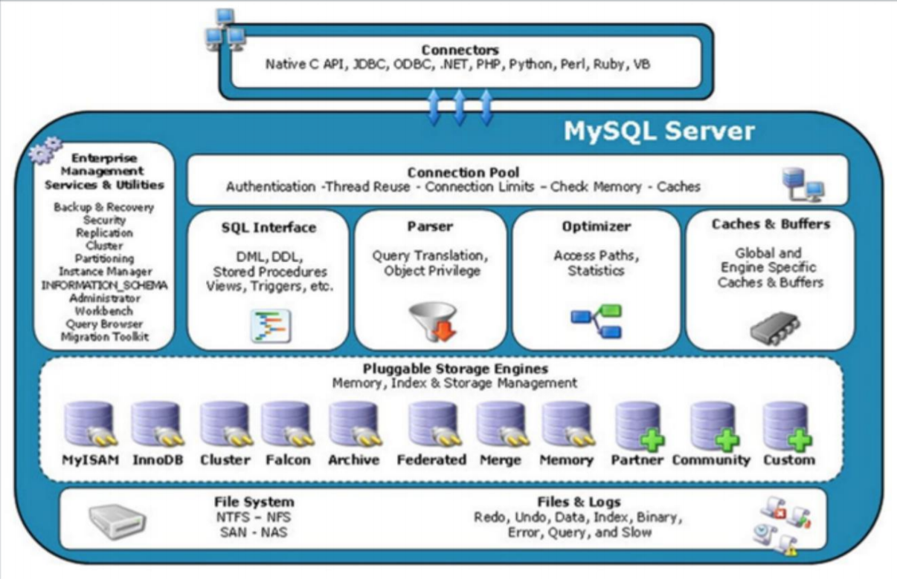
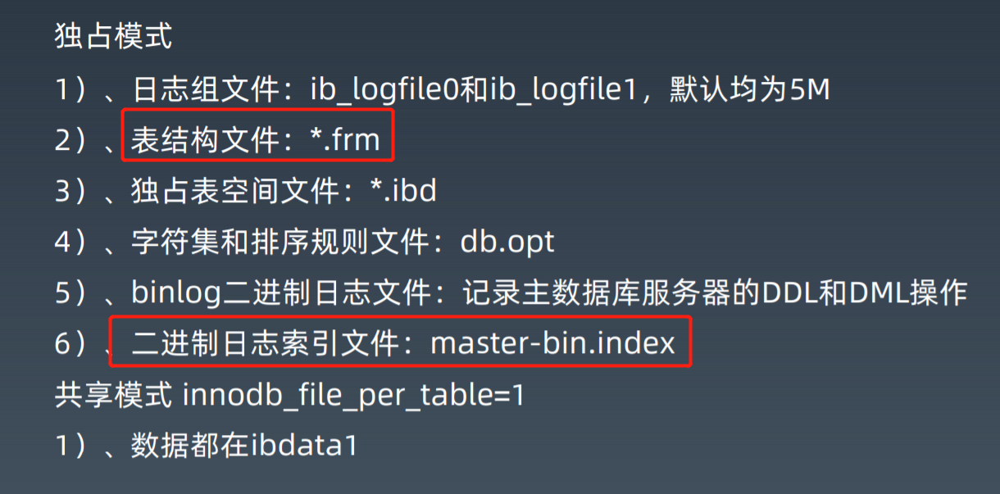
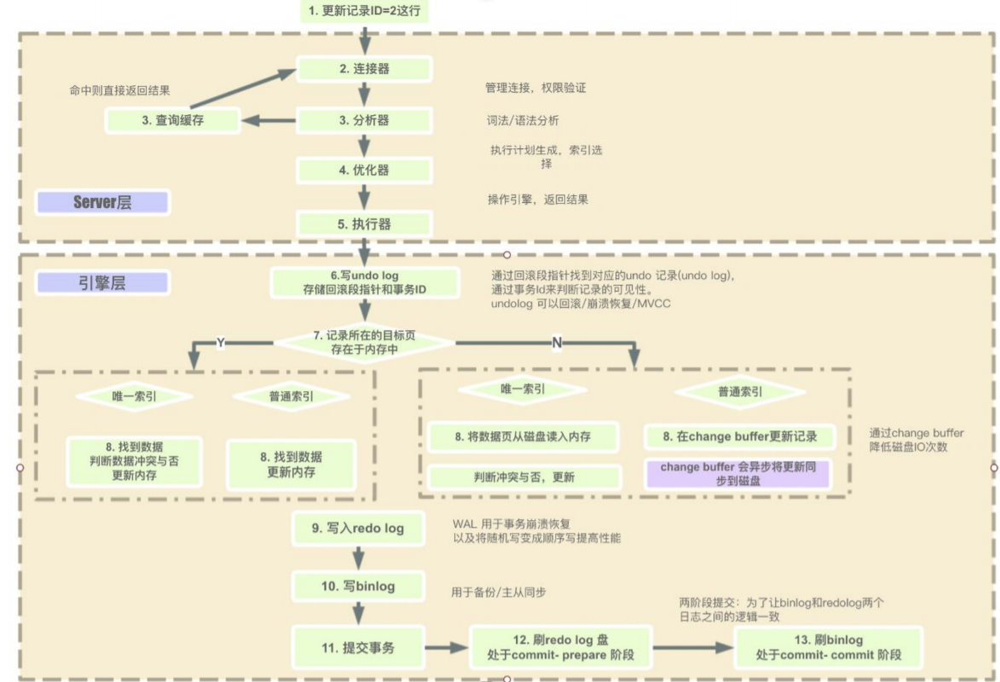
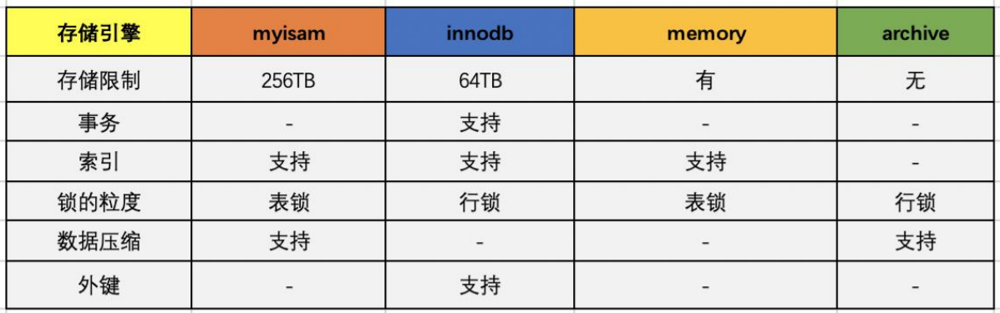
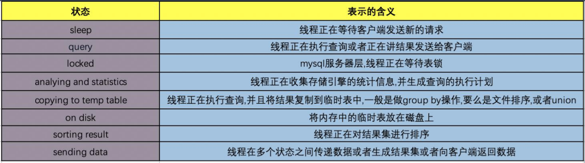
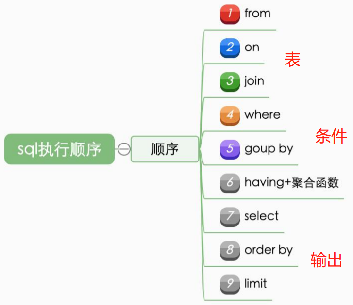

数据库基础

## 性能
1. 吞吐和延迟
2. 没有量化就没有改进，目前现在业务的指标比技术指标更重要
3. 28原则，优先优化性能瓶颈问题，数据库慢SQL，开源节流
4. 过早的优化是万恶之源
5. 脱离场景谈性能都是耍流氓
6. 业务系统发展的不同阶段和事情，性能瓶颈要点不同，类似木桶装水

性能是一个综合性的问题

## DB/SQL优化是业务系统性能优化的核心
* 业务系统的分类：计算密集型和数据密集型（主要）
* 数据库不方便和业务处理一样增加机器解决性能问题，因为业务处理本身无状态，但数据状态最终要保存到数据库
* 一般来说，DB/SQL操作的消耗在一次处理中占比最大

## 关系数据库

#### E-R图

#### 数据库设计范式

如以下表结构：

* 1NF:每一列的属性都不可再分（例子：系名-系主任，可以分成两列）

  满足

* 2NF:每一行都被主键唯一标识，即每一行都可以被主键表示

  不满足，拆分成如下结构

* 3NF:消除传递依赖，消除表中列不依赖主键，而依赖表中的非主键列的情况，即没有列是与主键不相关的

  不满足，拆分成如下结构

* BCNF:

* 4NF:消除不合适的多值依赖
* 5NF:消除不合适的连接依赖

* 经常打破范式，增加冗余

## SQL语言
结构化查询语言包含6部分
1. 数据查询语言(DQL)*:SELECT、WHERE、ORDER BY、GROUP BY、HAVING
2. 数据操作语言(DML)*:INSERT、UPDATE、DELETE
3. 事务控制语言(TCL):COMMIT、SAVEPOINT、ROLLBACK
4. 数据控制语言(DCL):GRANT
5. 数据定义语言(DDL):CREATE、ALTER、DROP、增加索引
6. 游标控制语言(CCL):CURSOR用的少

## MySQL架构图

## MySQL存储

information-schema 类似元数据信息

## MySQL执行流程

## MySQL执行引擎对比

## MySQL状态

## MySQL对SQL执行顺序

## MySQL索引原理

数据是存在文件里，是按页来分块的，当一个数据被使用时，其附近的数据也通常会马上被使用

InnoDB 使用 B+树实现聚集索引

> 为什么一般单表数据不超过2000万？
> 我们希望B+树层级不超过3层，假设id是bigint 八个字节，指针6字节，所以一个主键14个字节，mysql页默认是16k，一个页可以放1170个主键，高度为2的B+树最多有16个块，能放18720条数据，三层的B+树为最大2千万

show variables // 查看mysql参数

## MySQL参数配置优化

#### 连接请求的变量
1. max_connections  *
2. back_log
3. wait_timeout
4. interative_time

#### 缓冲区变量
1. key_buffer_size
2. query_cache_size *
3. max_connect_errors
4. sort_buffer_size
5. max_allowed_packet=32M
6. join_buffer_size=2M
7. thread_cache_size=300

#### innodb变量

## MySQL设计优化-最佳实践

#### 如何恰当选择引擎
innodb

#### 库表如何命名
有意义

#### 如何合理拆分宽表
 范式

#### 如何选择恰当的数据类型？
明确，尽量小
char、varchar的选择？
text/blob/clob 尽量不用 --> 性能下降
文件。图片是否要存在数据库？非常不建议，分布式文件系统，TFS，FastDFS
时间日期的存储问题？ 时区，（时间戳 bigint，对计算友好）
数值精度问题？ 字符串，X1000倍,解决精度丢失的问题

#### 使用外键和触发器？
尽量不适用，通过逻辑保证

#### 唯一约束和索引关系？
设置了唯一约束，就设置了索引

#### 可以使用冗余字段？
如果可以使用系统可以更高效的查询数据

#### 游标，变量，视图，存储过程？
不适用，很难维护，很难移植

#### 自增主键的使用问题？

#### 在线修改表结构（DDL）
会全局加锁，晚上夜深人静

#### 逻辑删除还是物理删除?
重要信息要逻辑删除

#### 要不要加create_time,update_time时间戳？
非常建议
同步数据

#### 数据库碎片问题？
数据压缩，上锁

#### 如何快速导入导出，备份数据？

使用原生命令
先把索引，约束去掉，导好后统一创建

SaaS  软件及服务，共享一套软件，开账号
PaaS  基础设施共享  google GAE ，平台即服务
LaaS  看起来拿到的就是机器，自己可以搞任何东西
FaaS  函数即服务，Serverless，运行代码片段，大趋势
DaaS  数据

《高可用MySQL》
《高性能MySQL》
《java8实战》
《mysql技术内幕》
《数据库系统全书》特别推荐
《数据密集型应用系统设计》
