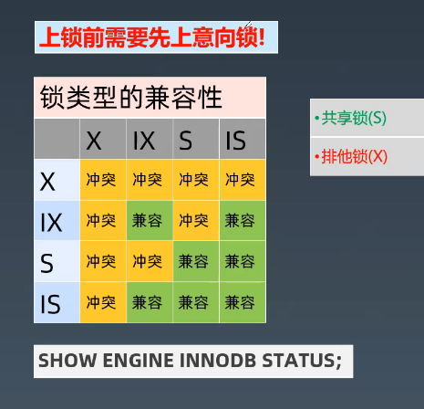
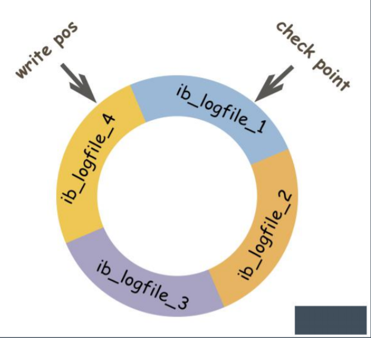

### MySQL事务

> 平衡`性能`和`可靠性`

#### 事务可靠性模型ACID
* Atomicity: 原子性，一次事务要么全部成功，要么全部失败
* Cosistency:一致性，数据库保持一致状态，业务语义是完整的
* Isolation:隔离性，四个隔离级别，保护事务不会互相干扰
* Durability:持久性，事务提交成功后，不会丢数据

#### 四种隔离级别

> `性能`和`一致性`的平衡

* `读未提交` (无并发控制，如果数据回滚，可能读到脏数据)
* `读已提交RC` (看到的都是其他事务提交的状态，多次读数据可能不同)
  * 每次查询都会设置和读取自动新快照
  * 仅支持基于行的bin-log
  * 不可重复读:不加锁情况下，其他事务update或delete会对查询结果又影响
  * 幻读：加锁后，不锁定间隙，其他事务可以Insert
  *
* `可重复读RR`
  * InnoDB 默认隔离级别
  * 使用事务第一次读取时创建的快照
  * `多版本技术`
  * 使用唯一索引的唯一查询条件时，只锁定查到的索引记录，不锁定间隙
  * 其他查询条件，会锁定扫描到的索引范围，通过间隙锁或临键锁来阻止其他会话在这个范围中插入值，（使用范围的update或delete会使性能急剧下降）
  * 可能的问题：InnoDB不能保证没有幻读，需要加锁
* `可串行化`

### 锁

#### 表级锁

意向锁：表明事务稍后要进行哪种类型的锁定
* 共享意向锁(IS):打算在某些行上设置共享锁
* 排他意向锁(IX):打算在某些行上设置排他锁
* Insert意向锁: Insert操作设置的间隙锁

自增锁(AUTO-IN)

LOCK_TABLES(DDL,DUMP)

#### 行级锁

* 记录锁(Record):始终锁定索引记录，注意隐藏的聚簇索引
* 间隙锁(Gap)
* 临键锁(Nect-Key)：记录锁和间隙锁的组合，可以锁定表中不存在记录
* 谓词锁(Predicat)：空间索引

#### 死锁
* 阻塞与互相等待
* 增删改，锁定读
* 死锁检测与自动回滚
* 锁粒度与程序设计

> 设置超时

### 日志

#### undo log 撤销日志
* 保证事务的原子性
* 用处：事务回滚、一致性读、崩溃恢复
* 记录事务回滚时所需的撤销操作
* 一条insert语句，对应一条delete的undo log
* 每个update语句，对应一条相反的update的undo log

回滚段(rollback segment)

#### redo log
* 确保事务的持久性，防止事务提交后数据未刷新到磁盘就掉电或崩溃
* 事务执行过程中写入 redo log 记录事务对数据页做了哪些修改
* 提升性能：WAL(write_ahead_logging)技术，先写日志，再写磁盘
* 日志文件：ib_logfile0,ib_logfile1
* 日志缓冲：innodb_log_buffer_size
* 强刷：fsync()

#### bin log

### MVCC:多版本并发控制

* 使`InnoDB`支持一致性读: `READ COMMITTED` 和 `REPEATABLE READ `
* 让查询不被阻塞、无需等待被其他事务持有的锁，这种技术手段可以增加并发性能。
* `InnoDB`保留被修改行的旧版本。
* 查询正在被其他事务更新的数据时，会读取更新之前的版本。
* 每行数据都存在一个版本号, 每次更新时都更新该版本
* 这种技术在数据库领域的使用并不普遍。 某些数据库, 以及某些MySQL存储引擎都不支持。

> 活着的事务才需要版本，只影响当前的事务

聚簇索引的更新 = 替换更新

二级索引的更新 = 删除+新建

-----
> now,sysdate 有什么区别？
