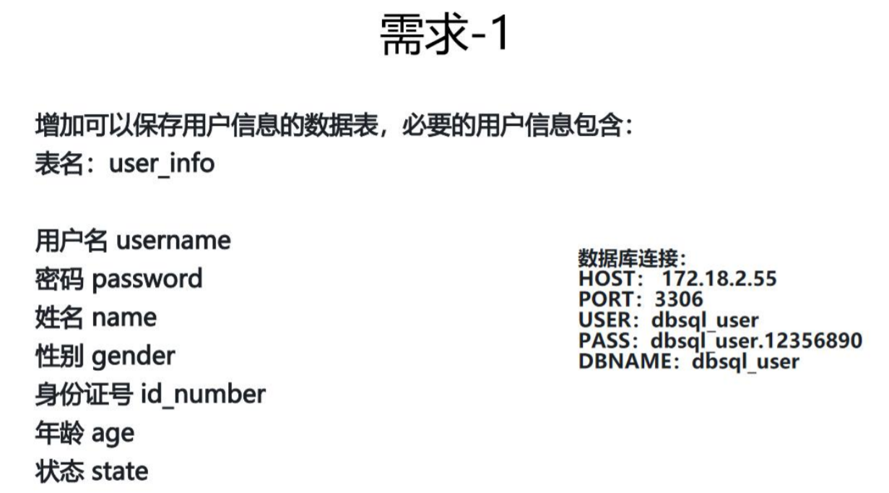
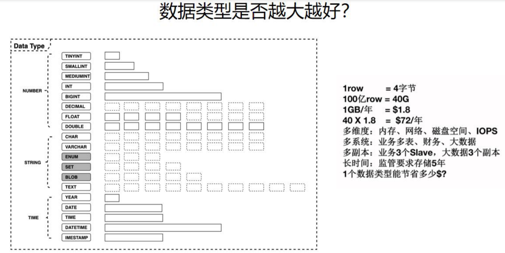
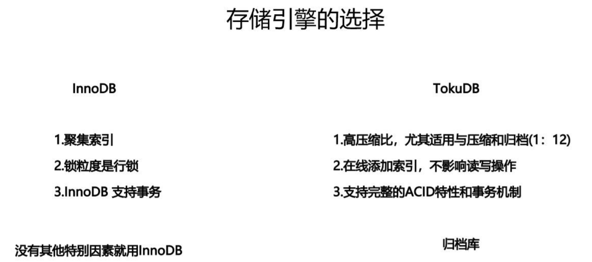
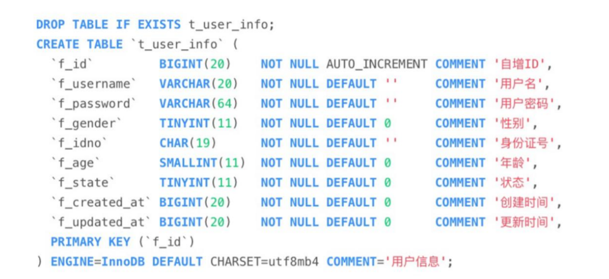
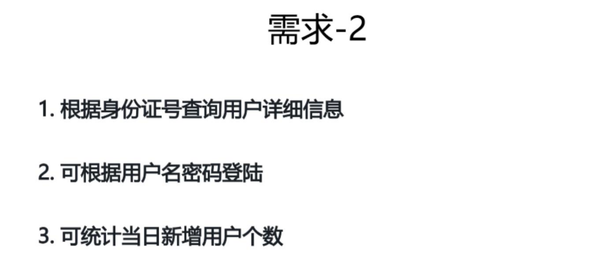
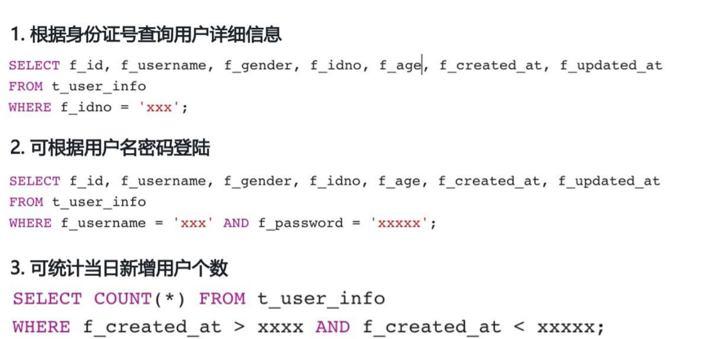
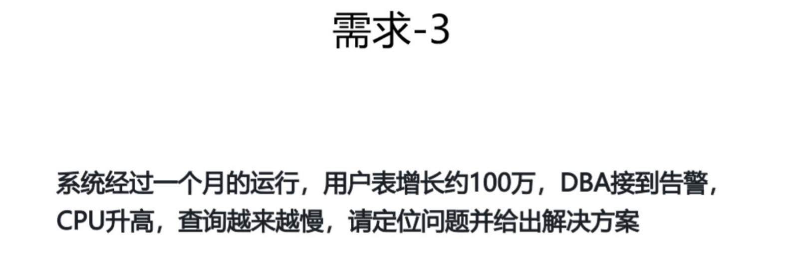
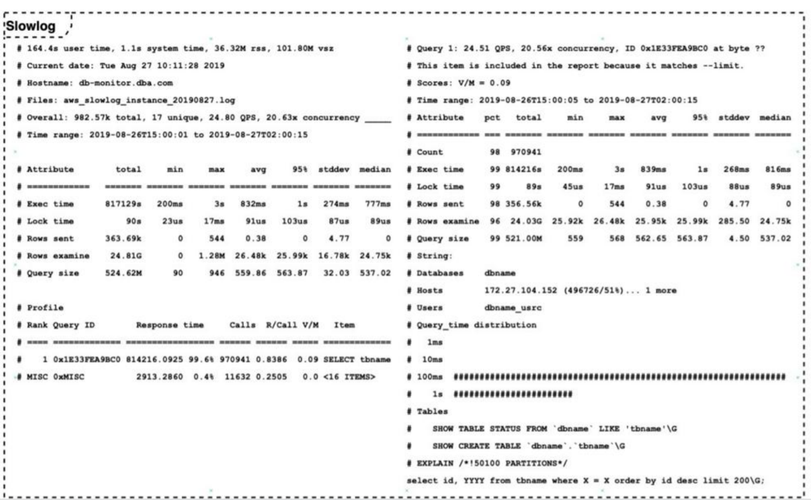
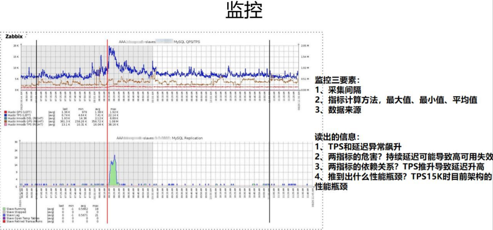

> 前四个倒序，后四个正序
> ORDER BY IF(f_id<5,-f_id, f_id)

> 时间可以用时间戳  
> char定长
> BIGINT(20) 后面的数字不影响实际大小

> 注意数据类型的选择
> 设计表之前，阅读DBA的指导手册，/dbaprinciples

------------------

> `f_password=0`,隐式转换，可能导致查询错误，还不会走索引
> 密码和身份证信息安全问题

> 定位问题的方法：
> - 慢查询日志
> - 看应用和监控日志

> 重点
> - Rank 排名
> - Response time  响应时间
> - Rows examine B+树上捞了多少行

