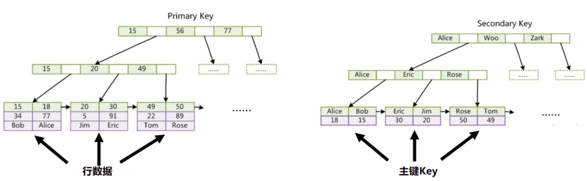

> 前四个倒序，后四个正序
> ORDER BY IF(f_id<5,-f_id, f_id)


> 时间可以用时间戳  
> char定长
> BIGINT(20) 后面的数字不影响实际大小


> 注意数据类型的选择
> 设计表之前，阅读DBA的指导手册，/dbaprinciples


------------------


> `f_password=0`,隐式转换，可能导致查询错误，还不会走索引
> 密码和身份证信息安全问题


> 定位问题的方法：
> - 慢查询日志
> - 看应用和监控日志


> 重点
> - Rank 排名
> - Response time  响应时间
> - Rows examine B+树上捞了多少行


> 为什么主键长度不宜过大？  
> 会减少在主键在B+tree上的数量


```sql
/*谁更快？*/
select * from table where id = xxx // id为主键
select * from table where name = xxx // 索引
```

考虑到聚集索引和二级索引，主键更快



#### 字段选择性-最左原则

创建索引要创建在区分度好的字段上，比如身份证号，而不是性别

区分度计算：discount()/count()

> 线上修改表结构的危害
> * 索引重建
> * 锁表
> * 抢占资源
> * 主从延迟


#### 写入优化

* 大批量写入优化：PreparedStatement add batch
* PreparedStatement减少SQL解析
* Load Data 直接导入
* 先干掉索引和约束，导入完成在加

#### 数据更新

* 数据范围更新
* Gap lock 导致锁范围扩大

#### 模糊查询

* like :走索引，只支持前缀匹配
* 全文检索：solr/ES


#### 连接查询

* 连接查询优化
* 驱动表的选择问题
* 避免笛卡尔积


#### 索引失效
* NULL,not,not in,函数等
* 减少使用or,可以使用union(注意union all的区别)
* 大数据量下，不要时所有条件组合都走索引，可以使用全文检索
* 可以使用 force index强制走某个索引


#### 查询SQL优化

* 查询数据量和查询次数的平衡
* 避免不必要的大量重复数据传输
* 避免使用临时文件排序或临时表
