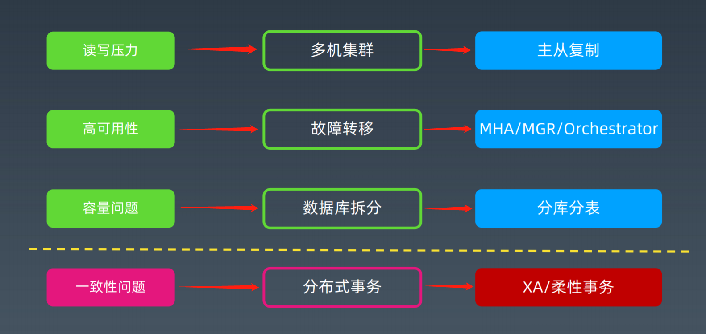
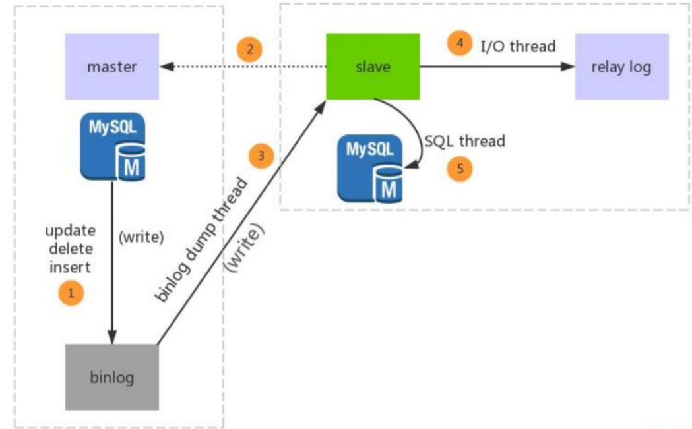
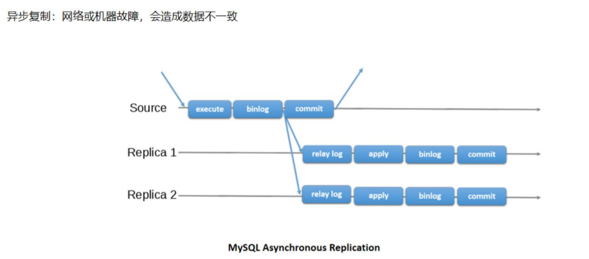
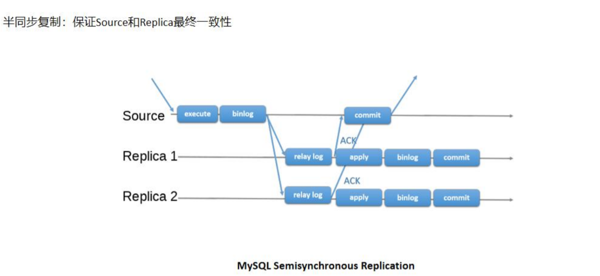
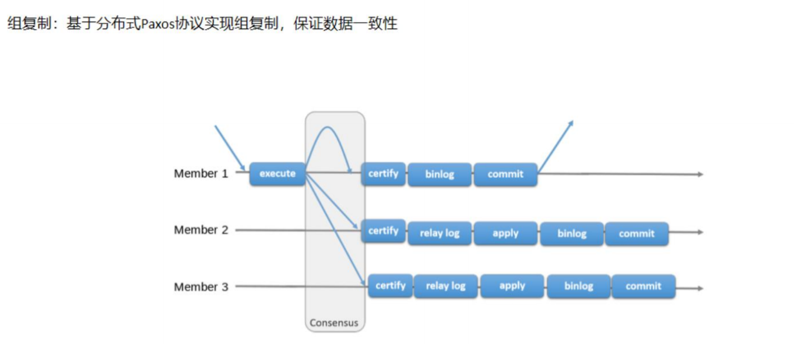
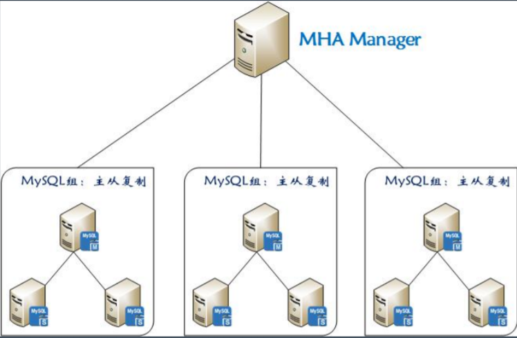
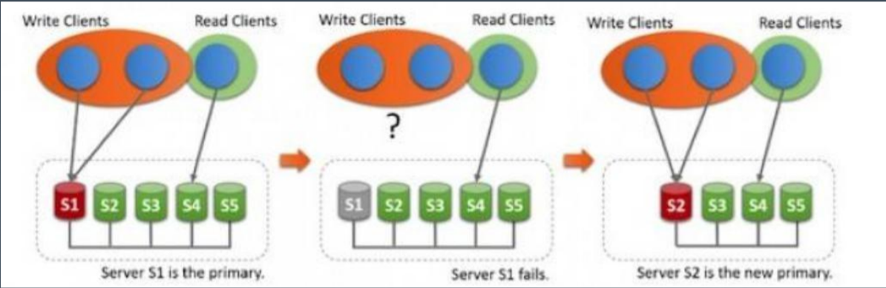
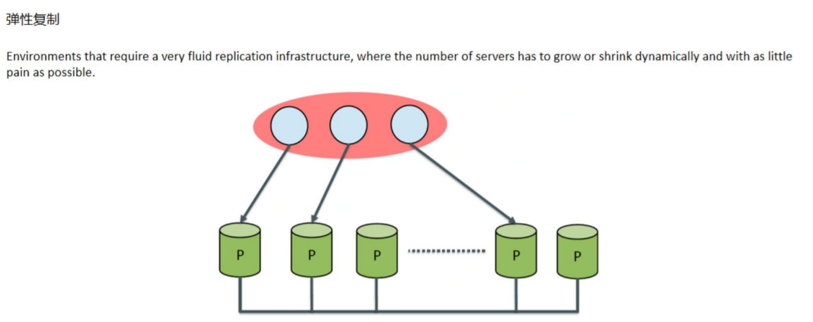
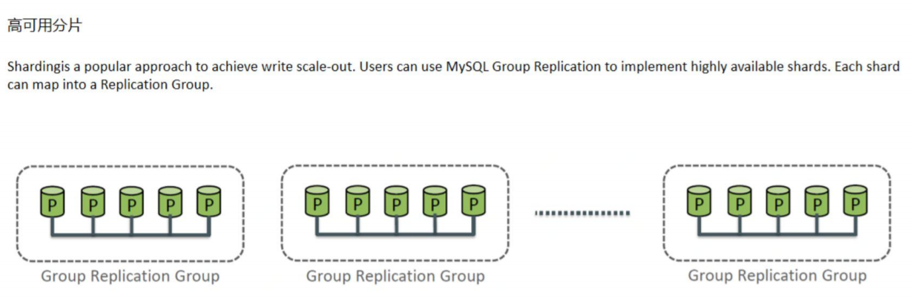
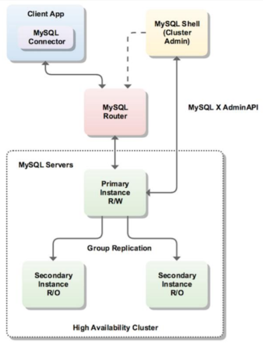

## 从单机到分布式

> `数据库`是有状态的，`应用系统`可以做成无状态的

随着数据量的增大，读写并发的增加，系统可用性要求的提升，单机MySQL面临：
1. 容量有限，难以扩容
2. 读写压力，QPS过大，特别是分析类需求会影响到业务事务
3. 可用性不足，宕机问题

qps/tps

> 更先进的技术，带来更复杂的问题

> 分布式事务：强一致性事务XA，柔性事务

## 主从复制

### 传统主从复制

> 半同步复制，至少有一个从库报告ack，主库才会commit，保证至少一个从库和主库保持一致，这样可以在主库宕机时，从库升级为主库

### MySQL Group Replication (MGR)

> 冷备和热备：一般指的是机器的backup，冷备的机器是不对外提供服务的，只有主服务机器宕机后，冷备机器才会对外提供服务，类似美国副总统，热备是指备份机器也会处理部分服务

## 高可用

99.99 = 8760 * 0.0001 = 0.876小时 = 0.876 * 60 = 52.6分钟

1. 读写分离，提升读的处理能力 
2. 故障转移，灾难恢复，提供 failover 能力
3. 连接池的心跳重试，实现断线重连，业务不间断，降低 RTO 和 RPO。

常见的一些策略： 

1. 多个实例不在一个主机/机架上
2. 跨机房和可用区部署 
3. 两地三中心容灾高可用方案

### MySQL高可用：MHA

MHA（Master High Availability）目前在 MySQL 高可用方面是一个相对成熟的解决方案， 是一套优秀的作为 MySQL 高可用性环境下故障切换和主从提升的高可用软件。一般能在30s内实现主从切换。 切换时，直接通过SSH复制主节点的日志。

### MySQL高可用：MGR *

如果主节点挂掉，将自动选择某个从改成主； 无需人工干预，基于组复制，保证数据一致性。

>  问题？ 
>
> 1. 外部获得状态变更需要读取数据库
> 2. 外部需要使用LVS/VIP配置。

MGR特点

1. 高一致性：基于分布式Paxos协议实现组复制，保证数据一致性
2. 高扩展性：节点的增加和移除会自动更新组成员信息，新节点加入后，自动从其他节点同步增量数据，直到和其他节点数据一致
3. 高灵活性：提供单主和多主模式，单主模式在主库宕机后会自动选主，所有写入都从主节点进行，多主模式支持多节点写入
4. 高容错性：自动检测机制，只要不是大多数节点都宕机就 可以继续工作，内置防脑裂保护机制

适用场景

### MySQL高可用：MySQL InnoDB Cluster

完整的数据库层高可用解决方案，高可用框架

1. MySQL Group Replication: 提供DB的扩展，自动故障转移
2. MySQL Router：轻量级中间件，提供应用程序连接目标的故障转移
3. MySQL Shell :新的MySQL客户端，多种接口模式，可以设置群组复制及Router

