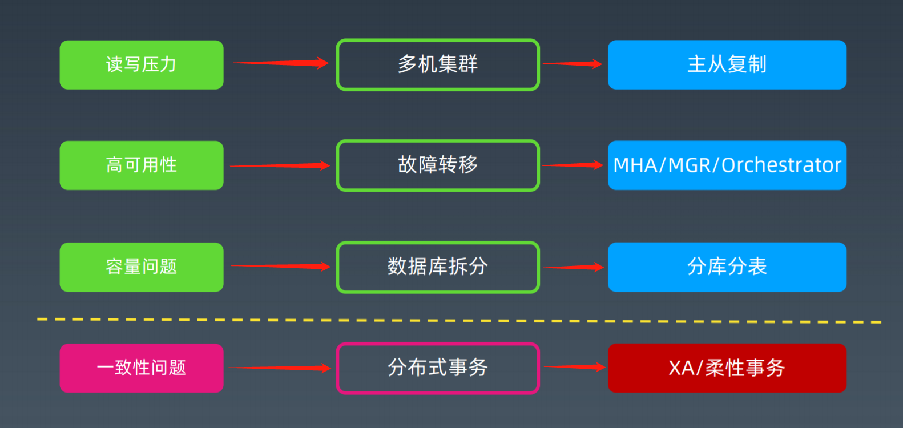
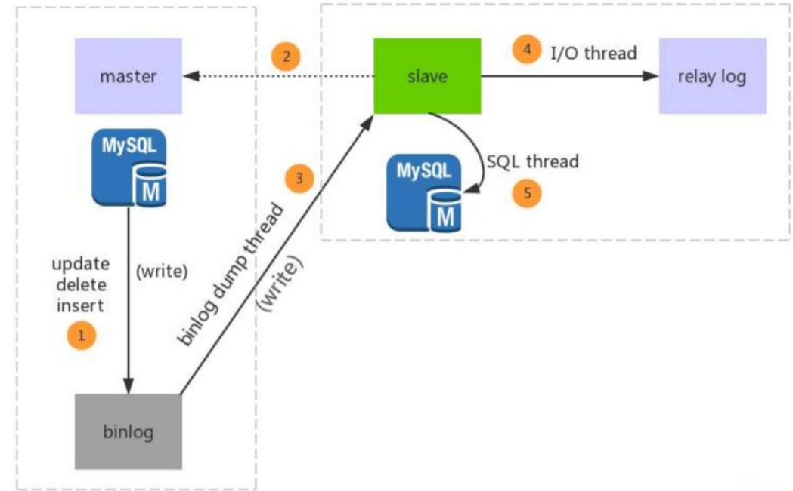
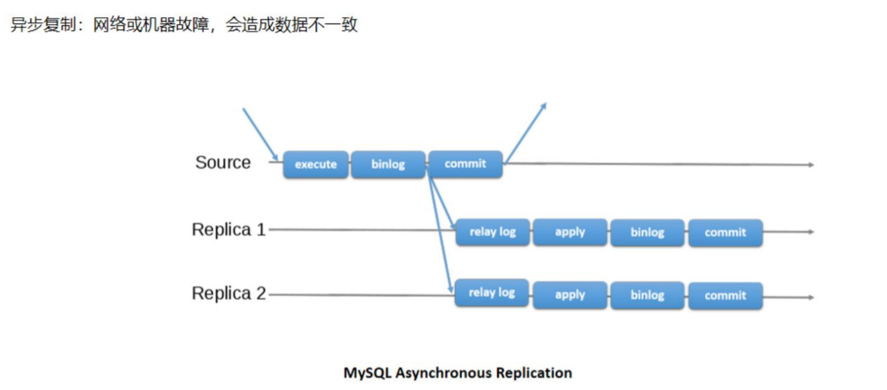
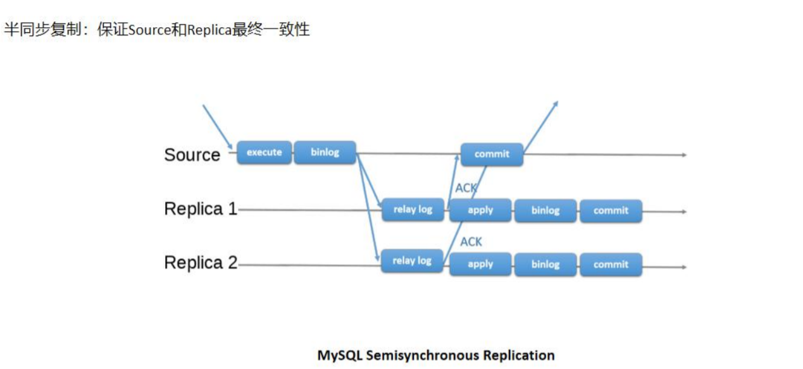
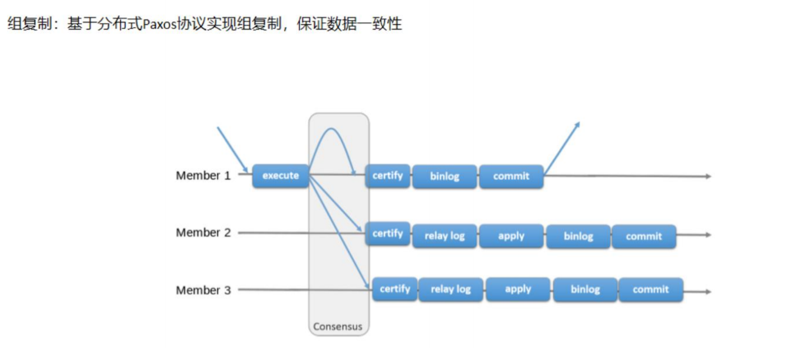

## 从单机到分布式

> `数据库`是有状态的，`应用系统`可以做成无状态的

随着数据量的增大，读写并发的增加，系统可用性要求的提升，单机MySQL面临：
1. 容量有限，难以扩容
2. 读写压力，QPS过大，特别是分析类需求会影响到业务事务
3. 可用性不足，宕机问题

qps/tps

> 更先进的技术，带来更复杂的问题

> 分布式事务：强一致性事务XA，柔性事务

## 主从复制

### 传统主从复制

> 半同步复制，至少有一个从库报告ack，主库才会commit，保证至少一个从库和主库保持一致，这样可以在主库宕机时，从库升级为主库

### MySQL Group Replication (MGR)

> 冷备和热备：一般指的是机器的backup，冷备的机器是不对外提供服务的，只有主服务机器宕机后，冷备机器才会对外提供服务，类似美国副总统，热备是指备份机器也会处理部分服务
