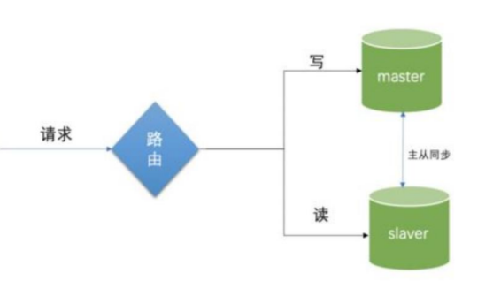
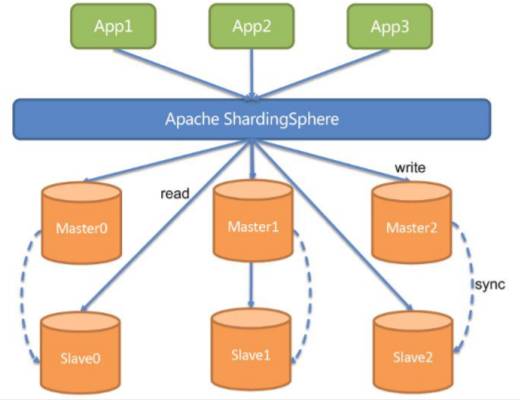

> 配置多数据源实现读写分离

### 读写分离-动态切换数据源版本1.0 

> 问题：`侵入性较强`、`如果写和读非常快会由‘写完读’不一致问题`

1. 基于Spring/Spring Boot，配置多个数据源(例如2个，master和slave) 
2. 根据具体的Service方法是否会操作数据，注入不同的数据源
3. 改进一下
   1. 基于操作AbstractRoutingDataSource和自定义注解readOnly之类 的，简化自动切换数据源 
   2. 支持配置多个从库
   3. 支持多个从库的负载均衡。

###  读写分离-数据库框架版本2.0 

> 问题：对业务系统还是有侵入、对已存在的旧系统改造不友好 

使用ShardingSphere-jdbc的Master-Slave功能 

1. SQL解析和事务管理，自动实现读写分离：通过SQL解析，可以判断sql是读还是写，自动走主库和从库
2. 解决”写完读”不一致的问题 ：如果出现一个写，后面的读都会走主库

### 读写分离-数据库中间件版本3.0

改进方式，MyCat/ShardingSphere-Proxy的Master-Slave功能

1. 需要部署一个中间件，规则配置在中间件
2. 模拟一个MySQL服务器，对业务系统无侵入   