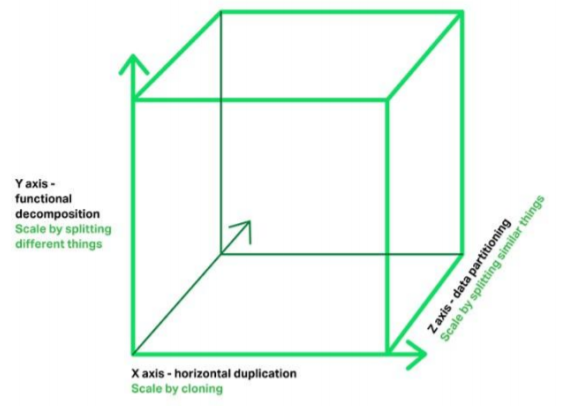
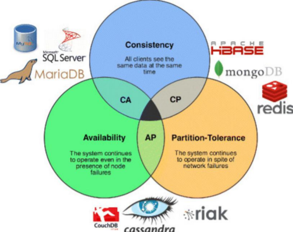

## 为什么要做数据库拆分

业务飞速发展导致了数据规模的急速膨胀，单机数据库已经无法适应互联网业务的发展 

传统的将数据集中存储至单一数据节点的解决方案，在`容量`、`性能`、`可用性`和`运维成本`这几个方面已经难于满足互联网的海量数据场景。在单库单表数据量超过一定容量水位的情况下，`索引树层级增加`，`磁盘 IO `也很可能出现压力，会导致很多问题。

 从性能方面来说，由于关系型数据库大多采用 B+树类型的索引，在数据量超过阈值的情况下，索引深度的增加也将使得磁盘访问的 IO 次数增加，进而导致查询性能的下降；同时，高并发访问请求也使得集中式数据库成为系统的最大瓶颈。 

从可用性的方面来讲，服务化的无状态型，能够达到较小成本的随意扩容，这必然导致系统的最终压力都落在数据库之上。而单一的数据节点，或者简单的主从架构，已经越来越难以承担。从运维成本方面考虑，当 一个数据库实例中的数据达到阈值以上，数据备份和恢复的时间成本都将随着数据量的大小而愈发不可控。

> 1. 无法执行 DDL，比如添加一列，或者增加索引，都会直接影响线上业务，导致长时间的数据库无响应。
> 2. 无法备份，与上面类似，备份会自动 lock 数据库的所有表，然后导出数据，量大了就没法执行了。
> 3. 影响性能与稳定性，系统越来越慢，随时可能会出现主库延迟高，主从延迟很高， 且不可控，对业务系统有极大的破坏性影响。

## 数据库拆分

分库分表，分布式，多个数据库，作为数据分片的集群提供服务。 降低单个节点的写压力。 提升整个系统的数据容量上限。

> 扩展立方体
>
> X轴：通过clone整体系统复制，集群
>
> Y轴：通过解耦不同功能复制，业务拆分
>
> Z轴：通过拆分不同数据扩展，数据分片

## 数据库垂直拆分

### 垂直拆库：

将一个数据库，拆分成多个提供不同业务数据处理能力的数据库。

> 例如拆分所有订单的数据和产品的数据，变成两个独立的库，这种方式对业务系统有极大的影响，因为数据结构本身发生了变化，SQL 和关联关系也必随之发生了改变。原来一个复杂 SQL 直接把一批订单和相关的产品都查了出来，现在这个 SQL 不能用了，得改写 SQL 和程序。先查询订单库数据，拿到这批订单对应的所有产品 id，再根据产品 id 集合去产品库查询所有的产品信息，最后再业务代码里进行组装。

 

### 垂直拆表：

如果单表数据量过大，还可能需要对单表进行拆分。

> 比如一个 200 列的订单主表，拆分成十几个子表：订单表、订单详情表、订单收件信息表、订 单支付表、订单产品快照表等等。这个对业务系统的影响有时候可能会大到跟新作一个系统差 不多。对于一个高并发的线上生产系统进行改造，就像是给心脑血管做手术，动的愈多，越核心，出现大故障的风险越高。所以，我们一般情况下，尽量少用这种办法

垂直拆分的优点：

1. 单库(单表) 数据量变小，便于管理和维护
2. 对性能和容量有所提升
3. 系统和数据库复杂度降低
4. 可以作为微服务改造的基础

垂直拆分的缺点

1. 库便多，管理复杂
2. 有拆分极限
3. 对业务侵入强，改造复杂，风险比较大

> 数据孤岛，数据仓库，数据集市，数据湖？
>
> 数据治理 DAMA？
>
> 架构：TOGAF？
>
> 项目：PMP？
>
> HR：六大模块，三三制

### 垂直拆分的做法

1. 梳理清楚拆分范围和影响范围
2. 检查和评估重构影响到的服务
3. 准备新的数据库集群复制数据
4. 修改系统配置并发布新版上线

> 先拆分系统还是先拆分数据库？
>
> 先拆分多大范围？评估数据量和增量

## 水平拆分

### 水平拆分（按主键分库分表）：

水平拆分就是直接对数据进行分片，有分库和分表两个具体方 式，但是都只是降低单个节点数据量，但不改变数据本身的结构。这样对业务系统本身的代码 逻辑来说，就不需要做特别大的改动，甚至可以基于一些中间件做到透明。

> 比如把一个 10 亿条记录的订单单库单表（orderDB 库 t_order 表）。我们按照用户 id 除以 32 取模，把单库拆分成 32 个库orderDB_00..31；再按订单 id 除以 32 取模，每个库里再拆分成 32 个表t_order_00..31。这样一共是 1024 个子表，单个表的数据量就只是 100 万条了。 一个查询如果能够直接路由到某个具体的字表，比如orderDB05.t_order_10 ，那么查询效率 就会高很多

### 水平拆分（按时间分库分表）

很多时候，我们的数据是有时间属性的，所以自然可以按照时间维度来拆分。比如当前数据表和历史数据表，甚至按季度，按月，按天来划分不同的表。这样我们按照时间维度来查询数据时，就可以直接定位到当前的这个子表。

1. 强制按条件指定分库分表：比如配置好某些用户的数据进入单独的库表，其他数据默认处理。 

2. 自定义方式分库分表：指定某些条件的数据进入到某些库或表。

> 为什么不建议分表，建议分库？
>
> 分表不解决容量问题，不解决I/O问题
>
> 可以用分库代替分表

### 分库还是分表，如何选择 一般情况下？

如果数据本身的读写压力较大，磁盘 IO 已经成为瓶颈，那么分库比分表要好。

分库将数据分散到不同的数据库实例，使用不同的磁盘，从而可以并行提升整个集群的并行数据 处理能力。相反的情况下，可以尽量多考虑分表，降低单表的数据量，从而减少单表操作的时间，同时也能在单个数据库上使用并行操作多个表来增加处理能力

### 水平拆分的优点

1. 解决容量问题
2. 比垂直拆分对系统影响小
3. 部分提升性能和稳定性 

### 水平拆分的缺点：

1. 集群规模大，管理复杂
2. 复杂SQL支持问题
3. 数据迁移问题
4. 一致性问题，尽量把需要事务的表，放在同一个库里

> 淘宝，通过卖家id分库，如果用买家id查询怎么办？
>
> 1. 广播，聚合（不适用）
> 2. 另一套异构库表，通过买家id分库 *

## 数据分类管理

通过分类处理提升数据管理能力 

随着我们对业务系统、对数据本身的进一步了解，我们就会发现，很多数据对质量的要求是不 同的。 

比如，订单数据，肯定一致性要求最高，不能丢数据。而日志数据和一些计算的中间数据，我们则是可以不要那么高的一致性，丢了不要了，或者从别的地方找回来。 同样地，我们对于同样一张表里的订单数据，也可以采用不同策略，无效订单如果比较多，我 们可以定期的清除或者转移（一些交易系统里有 80%以上是的机器下单然后取消的无意义订单，没有人会去查询它，所以可以清理）

如果没有无效订单，那么我们也可以考虑： 

1. 最近一周下单但是未支付的订单，被查询和支付的可能性较大，再长时间的订单，我们可以 直接取消掉。（热） 
2. 最近 3 个月下单的数据，被在线重复查询和系统统计的可能性最大。 （温）
3. 超过 3 个月、3 年以内的数据，查询的可能性非常小，我们可以不提供在线查询。（冷） 
4. 3 年以上的数据，我们可以直接不提供任何方式的查询。（-）

这样的话，我们就可以采取一定的手段去优化系统： 

1. 定义一周内下单但未支付的数据为热数据，同时放到数据库和内存；

2. 定义三个月内的数据为温数据，放到数据库，提供正常的查询操作； 

3. 定义 3 个月到 3 年的数据，为冷数据，从数据库删除，归档到一些便宜的磁盘，用压缩的 方式（比如 MySQL 的 tokuDB 引擎，可以压缩到几十分之一）存储，用户需要邮件或者提 交工单来查询，我们导出后发给用户； 

4. 定义 3 年以上的数据为冰数据，备份到磁带之类的介质上，不提供任何查询操作。

   

我们可以看到，上面都是针对一些具体场景，来分析和给出解决办法。那么通过在各种不同的 场景下，都对现有的技术和手段进行一些补充，我们就会逐渐得到一个复杂的技术体系

## 框架和中间件

#### Java框架层面

- TDDL

- Apache ShardingSphere-JDBC

#### 中间件层面

- DRDC（商业闭源）
- Apache ShardingSphere-Proxy：对应用程序透明（暴露的是MySQL）,可以使用其他语言访问
- MyCat
- Vitness

## 数据库中间件的技术演进

CAP

## 数据迁移

迁移是最容易出故障的一个点

#### 全量数据导出和导入 

1. 业务系统停机
2. 数据库迁移，校验一致性，（数据一致，关系一致，约束一致），（先导数据，在建索引和约束）
3. 然后业务系统升级，接入新数据库

直接复制的话，可以dump后全量导入

如果是异构数据，需要用程序来处理 

优点：简单

缺点：停机时间长

#### 全量＋增量

依赖于数据本身的时间戳

1. 先同步数据到最近的某个时间戳 
2. 然后在发布升级时停机维护
3. 再同步最后一段时间（通常是一天）的变化数据
4. 最后升级业务系统，接入新数据库。 

优点：极大降低停机时间

缺点：还是要停机

#### binlog+全量+增量

通过主库或者从库的binlog来解析和重新构造数据，实现复制。

一般需要中间件等工具的支持。 

可以实现多线程，断点续传，全量历史和增量数据同步。

 继而可以做到： 

1. 实现自定义复杂异构数据结构
2. 实现自动扩容和缩容，比如分库分表到单库单表，单库单表到分库分表，分4个库表 到分64个库表。 

优点： 不影响业务数据库

缺点：