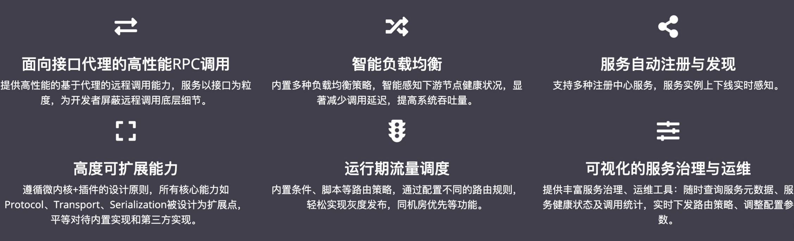
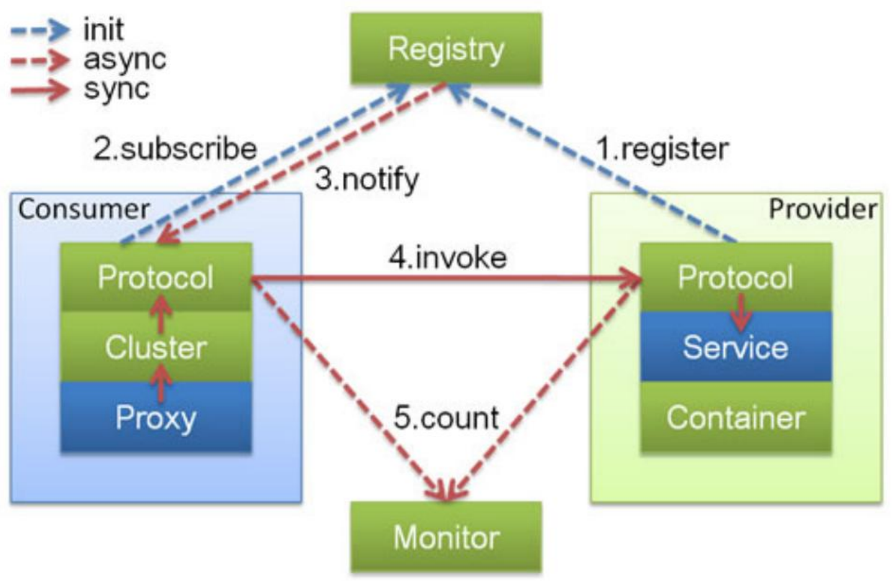
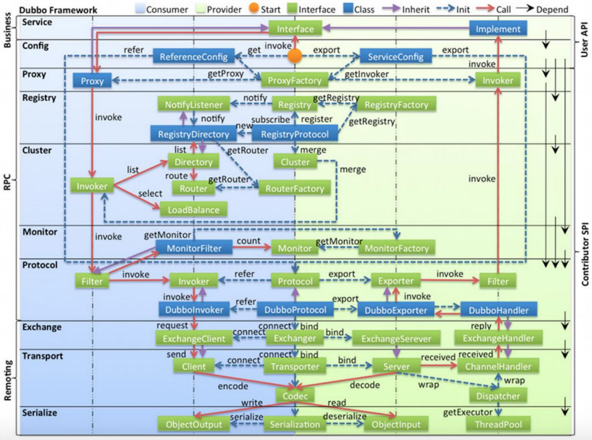

## Dubbo框架介绍

Apache Dubbo 是一款高性能、轻量级的开源 Java 服务框架

基础功能：RPC调用 (框架分层设计，可任意组装和扩展)

* 多协议（序列化、传输、RPC） 
* 服务注册发现
* 配置、元数据管理 

扩展功能：集群、高可用、管控 

* 集群，负载均衡 
* 治理，路由
* 控制台，管理与监控

## Dubbo技术原理

### 整体架构（核心原理）

<<<<<<< HEAD
### 三大核心概念
=======
#### 三大核心概念
>>>>>>> 37d4c149af0c8a1a3c18a5f3fcd520d3de5cb2cc

invoker 包装服务

protocol 协议

URL 表示服务

## Dubbo应用场景 

## Dubbo最佳实践

## 如何看Dubbo源码