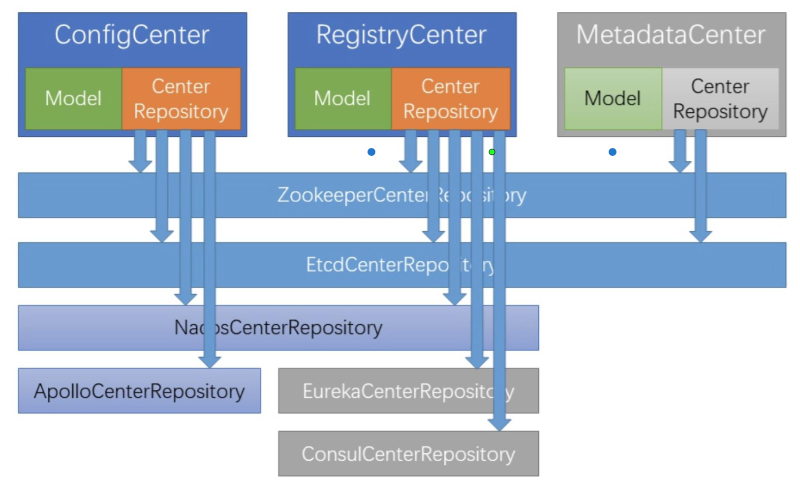

女王的棋局

## 分布式服务治理

流水线，串联

SOA：面向服务架构，企业级架构风格，将应用程序的不同功能单元进行拆分

Curator

## 配置/注册/元数据中心

* 配置中心(ConfigCenter):管理系统需要的配置参数信息 

* 注册中心(RegistryCenter):管理系统的服务注册、提供发现和协调能力 

* 元数据中心(MetadataCenter):管理各个节点使用的元数据信息

相同点:

* 都需要保存和读取数据/状态，变更通知 

不同点:

* 配置是全局非业务参数
* 注册中心是运行期临时状态
* 元数据是业务模型

## 服务的注册与发现

服务提供者启动时，

* 将自己注册到注册中心(比如zk实现)的临时节点。 
* 停止或者宕机时，临时节点消失

注册的数据格式

* 节点key，代表当前服务(或者服务+版本)
* 多个子节点，每一个为一个提供者的描述信息

服务消费者启动时，

* 从注册中心代表服务的主节点拿到多个代表提供者的临时节点列表，并本地缓存

* 根据router和loadbalance算法从其中的某一个执行调用。

* 如果可用的提供者集合发生变化时，注册中心通知消费者刷新本地缓存的列表。 

例如zk可以使用curator作为客户端操作。

##  服务的集群与路由

##  服务的过滤与流控

## 为什么需要服务流控(Flow Control)

稳定性工程: 

1、我们逐渐意识到一个问题:系统会故障是正常现象，就像人会生病 

2、那么在系统出现问题时，直接不服务，还是保持部分服务能力呢?

系统的容量有限。 保持部分服务能力是最佳选择，然后在问题解决后恢复正常状态。

响应式编程里，这就是所谓的回弹性(Resilient)。 

需要流控的本质原因是，输入请求大于处理能力。

## 服务流控

流控有三个级别:
1、限流(内部线程数，外部调用数或数据量) 

2、服务降级(去掉不必要的业务逻辑，只保留核心逻辑) 

3、过载保护(系统短时间不提供新的业务处理服务，积压处理完后再恢复输入请求