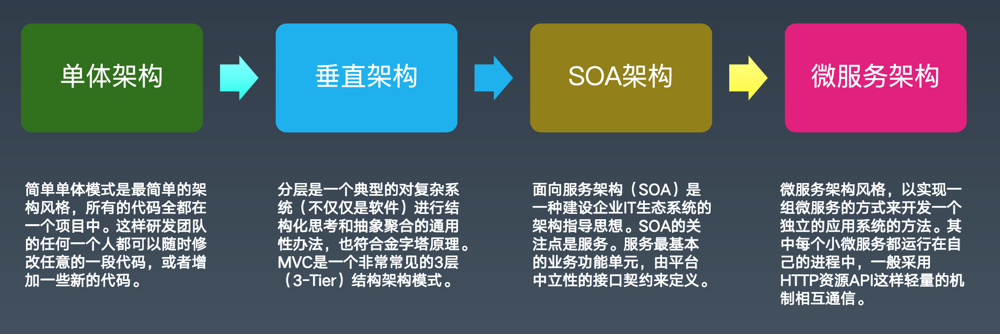
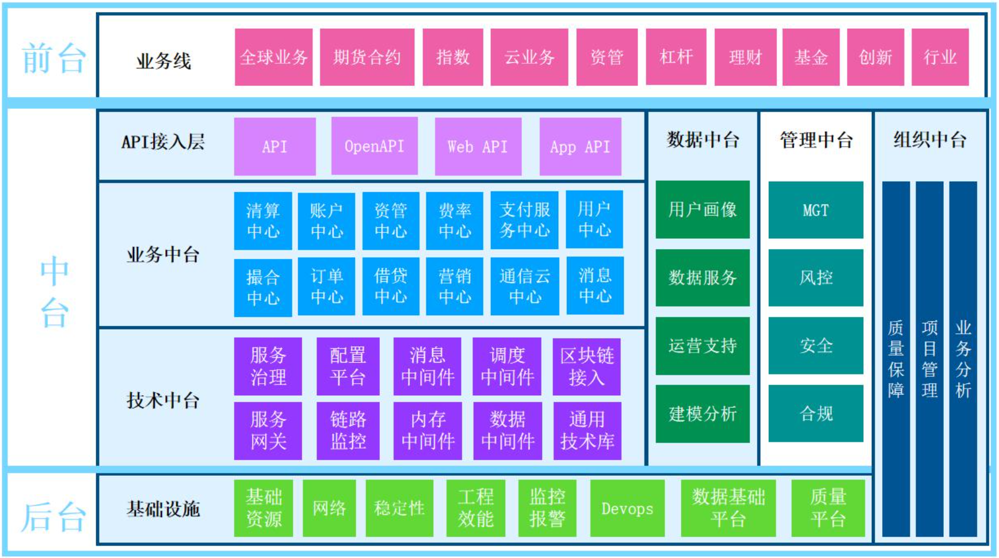

[TOC]

## 微服务架构发展历程

## 微服务架构应用场景

####  大规模复杂业务系统的架构升级与中台建设

## 微服务架构最佳实践

#### 遗留系统改造

1. 功能剥离，数据解耦

2. 自然演进，逐步拆分

3. 小步快跑，快速迭代

4. 灰度发布，谨慎试错

5. 提质量线，还技术债

   

#### 适当粒度拆分

1. 高内聚，低耦合
2. 不同阶段拆分要点不同，

#### 扩展立方体

#### 自动化管理

## Spring Cloud技术体系

## 微服务相关框架与工具

