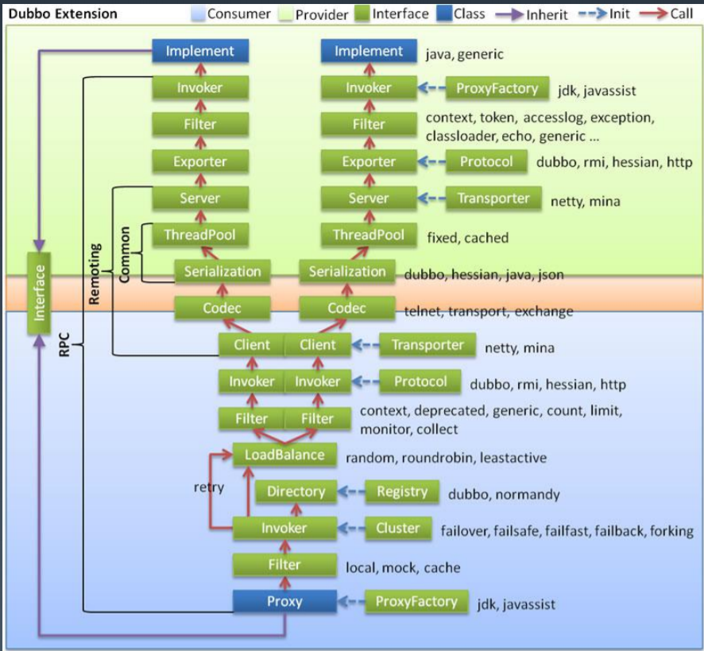
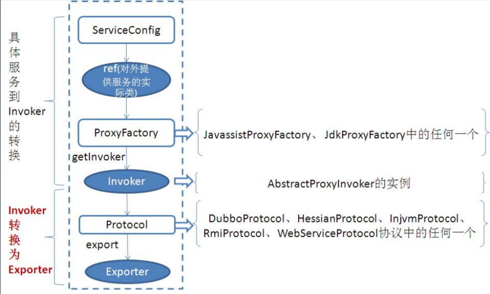
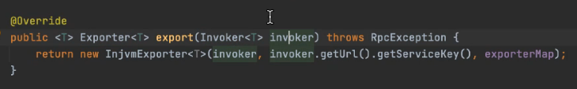
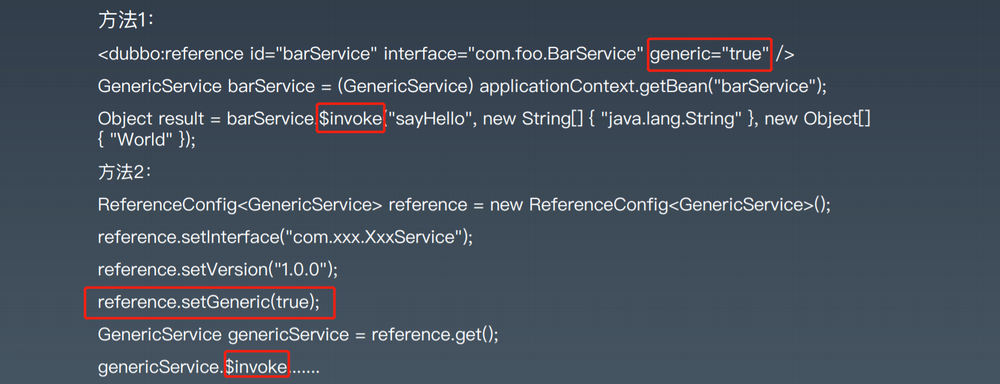
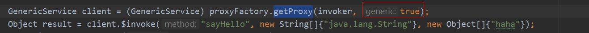

## 整体架构


1. config 配置层：对外配置接口，以 ServiceConfig, ReferenceConfig 为中心，可以直接初始 化配置类，也可以通过 spring 解析配置生成配置类 
2. proxy 服务代理层：服务接口透明代理，生成服务的客户端 Stub 和服务器端 Skeleton, 以 ServiceProxy 为中心，扩展接口为 ProxyFactory 
3. registry 注册中心层：封装服务地址的注册与发现，以服务 URL 为中心，扩展接口为 RegistryFactory, Registry, RegistryService 
4. cluster 路由层：封装多个提供者的路由及负载均衡，并桥接注册中心，以 Invoker 为中心， 扩展接口为 Cluster, Directory, Router, LoadBalance 
5. monitor 监控层：RPC 调用次数和调用时间监控，以 Statistics 为中心，扩展接口为 MonitorFactory, Monitor, MonitorService\
6.  protocol 远程调用层：封装 RPC 调用，以 Invocation, Result 为中心，扩展接口为 Protocol, Invoker, Exporter 
7.  exchange 信息交换层：封装请求响应模式，同步转异步，以 Request, Response 为中心， 扩展接口为 Exchanger, ExchangeChannel, ExchangeClient, ExchangeServer 
8. transport 网络传输层：抽象 mina 和 netty 为统一接口，以 Message 为中心，扩展接口为 Channel, Transporter, Client, Server, Codec 
9. serialize 数据序列化层：可复用的一些工具，扩展接口为 Serialization, ObjectInput, ObjectOutput, ThreadPool




## SPI的应用

ServiceLoader机制 META-INF/dubbo/接口全限定名，文件内容为实现类（ShardingSphere使用）

Dubbo的SPI扩展，最关键的SPI：Protocol xxx=com.alibaba.xxx.XxxProtocol 

启动时装配，并缓存到ExtensionLoader中。

## 服务如何暴露




以InjvmProtocol为例，（简单），服务和调用双方在同一个JVM进程

export   :    InjvmProtocol   ---> InjvmExporter



## 服务如何引用 

核心类`ReferenceConfig`

核心方法  `createProxy`

 创建 `Invoker`

## Cluster

* `Directory` : `List<Invoker>`
* `Router` ： 选取此次调用可以提供服务的  `invoker` 集合 eg.  Condition，Script，Tag
* `LoadBalance` ：从上述集合选取一个作为最终调用者 eg.  Random，RoundRobin，ConsistentHash


## 泛化引用 

GenericService 当我们知道接口、方法和参数，不用存根方式，而是用反射方式调用任何服务。






## 隐式传参

 Context模式

 RpcContext.getContext().setAttachment("index" , "1"); 

此参数可以传播到RPC调用的整个过程。 

如何实现的？ 如果是http，放入报文头。如果是二进制，参数拼入在二进制前

## Mock 

可以方便用来做 测试

```xml
<dubbo.reference id="helloService" interface="io.kmmking.HelloService" mock="true" timeout="1000" check="false">
```

需要实现一个 io.kimmking.HelloServiceMock类 


