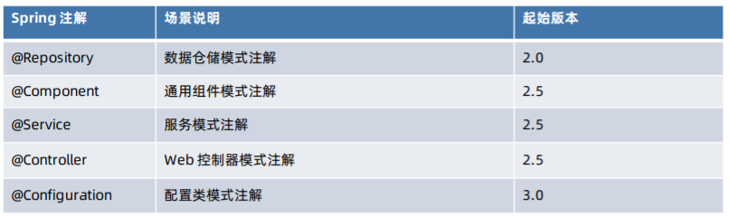
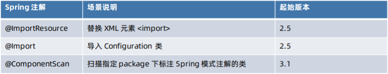
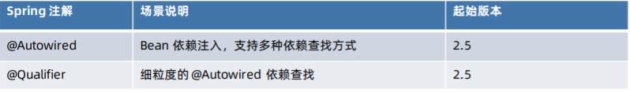

## Spring 核心注解场景分类

### Spring 模式注解

@Component 原理

- 核心组件
  - org.springframework.context.annotation.ClassPathBeanDefinitionScanner
  - org.springframework.context.annotation.ClassPathScanningCandidateComponentProvider
- 资源处理
  - org.springframework.core.io.support.ResourcePatternResolver
- 资源-类元信息
  - org.springframework.core.type.classreading.MetadataReaderFactory
- 类元信息   
  - org.springframework.core.type.ClassMetadata
    - ASM实现
      - org.springframework.core.type.classreading.ClassMetadataReadingVisitor
    - 反射实现
      - org.springframework.core.type.StandardAnnotationMetadata
- 注解元信息
  - org.springframework.core.type.AnnotationMetadata
  - org.springframework.core.type.classreading.SimpleAnnotationMetadata
    - ASM实现
      - org.springframework.core.type.classreading.SimpleAnnotationMetadataReadingVisitor
      - org.springframework.core.type.classreading.AnnotationMetadataReadingVisitor
    - 反射实现
      - org.springframework.core.type.StandardAnnotationMetadata

### Spring 装配注解

### Spring 依赖注入注解

## Spring @Enable 模块驱动

以 `@Enable` 为前缀的注解驱动编程模型,模块是指具备相同领域的功能组件集合，组合形成的独立单元，如Web MVC模块，AspectJ代理模块，Caching模块，JMX模块，Async模块等

* @EnableWebMVC
* @EnableTransactionManagement
* @EnableCaching
* @EnableMBeanExport
* @EnableAsync

### 模块驱动编程模式

1. 注解：@EnableXXX
2. 导入注解：@Import具体实现
3. 具体实现
   1. 基于Configuration Class
   2. 基于 ImportSelector 接口实现
   3. 基于 ImportBeanDefinitionRegistry 接口实现

## 条件注解

- 基于配置条件注解 @Profile
  - 关联对象 Environment中的Profiles
  - 从Spring4.0开始，@Profile基于@Conditional实现
- 基于编程条件注解@Conditional

### `@Conditional` 实现原理

* 上下文对象
  * org.springframework.context.annotation.ConditionContext
* 条件判断
  * org.springframework.context.annotation.ConditionEvaluator
* 配置阶段
  * org.springframework.context.annotation.ConfigurationCondition.ConfigurationPhase
* 判断入口
  * org.springframework.context.annotation.ConfigurationClassParser
  * org.springframework.context.annotation.ConfigurationClassPostProcessor