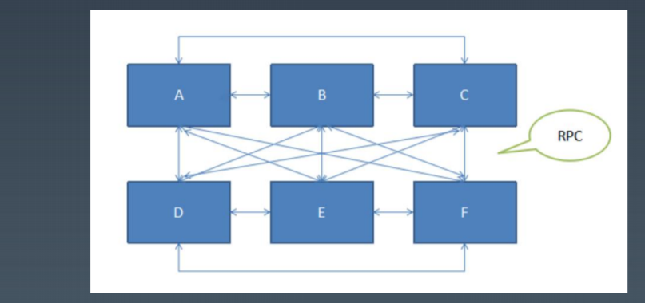
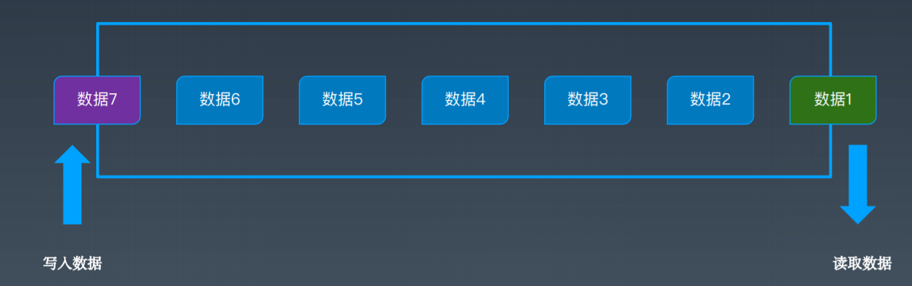
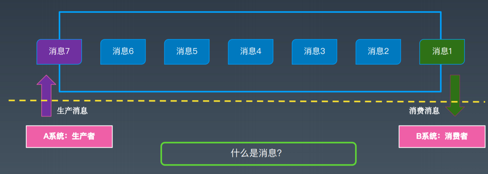
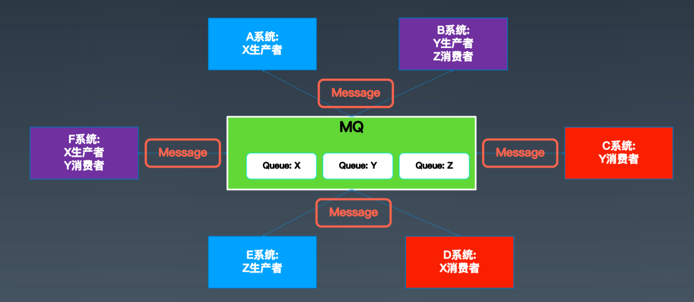
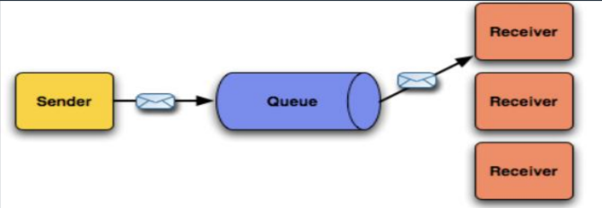
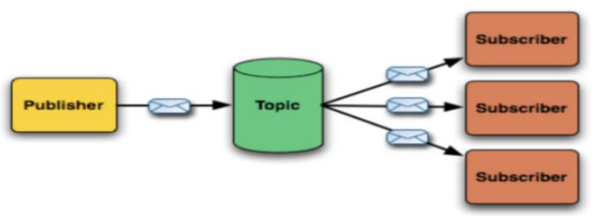

# 系统间通信方式 

基于文件：不方便，不及时

基于共享内存

基于IPC

基于Socket：高效，使用麻烦，多数情况下不如RPC

基于数据库，缓存：不实时，可以模拟消息队列，

基于RPC：调用关系复杂，同步处理，压力大时无法缓冲，流控

上面的方式各有优缺点，希望可以有这样的一个通信方式

1、异步

2、简化复杂的依赖关系

3、请求很大，缓冲以下

4、保障消息的可靠性，顺序

# 从队列到消息服务

内存里的queue

Message Queue

消息：传递信息

>  最核心的四个概念：生产者、消费者、queue、message

​	MQ的优势在于：

- 异步通信：异步通信，减少线程等待，特别是处理批量等大事务、耗时操作。
- 系统解耦：系统不直接调用，降低依赖，特别是不在线也能保持通信最终完成。
- 削峰平谷：压力大的时候，缓冲部分请求消息，类似于背压处理。
- 可靠通信：提供多种消息模式、服务质量、顺序保障等。

# 消息模式与消息协议

## 消息处理模式

- 点对点 : PTP Point-To-Point

- 发布订阅：PubSub   Publish-Subscribe

  

## 消息处理的保障

###  三种QoS

（注意：这是消息语义的，不是业务语义的）：

- `At most once`，至多一次，消息可能丢失但是不会重复发送；
- `At least once`，至少一次，消息不会丢失，但是可能会重复；
  - 幂等
  - 去重，roaringbitmap
- Exactly once，精确一次，每条消息肯定会被传输一次且仅一次。 

### 消息处理的事务性：

- 通过确认机制实现事务性； 

- 可以被事务管理器管理，甚至可以支持XA

## 消息有序性

同一个Topic或Queue的消息，保障按顺序投递。 

注意：如果做了`消息分区`，或者`批量预取`之类的操作，可能就没有顺序了

## 消息协议

STOMP

JMS*  J2EE

AMQP*  金融领域

MQTT*   IBM，物联网

XMPP 

Open Messaging

# ActiveMQ消息中间件

JMS介绍：我对JMS的理解和认识: https://kimmking.blog.csdn.net/article/details/6577021 

ActiveMQ官网： https://activemq.apache.org 

ActiveMQ集群-网络集群模式详解: https://kimmking.blog.csdn.net/article/details/8440150 

ActiveMQ的集群与高可用: https://kimmking.blog.csdn.net/article/details/13768367

