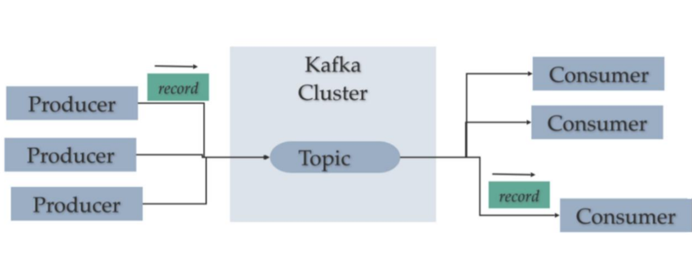
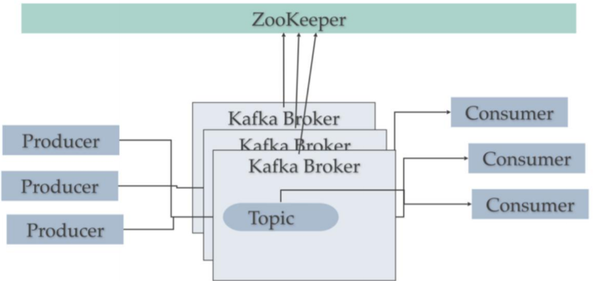
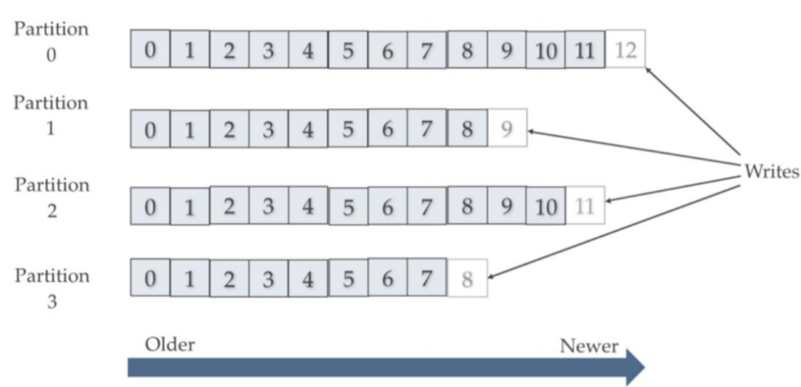

# Kafka概念与入门

Kafka 是一个消息系统，由 LinkedIn 于2011年设计开发，用作 LinkedIn 的活动流 （Activity Stream）和运营数据处理管道（Pipeline）的基础。 

Kafka 是一种 **分布式的**，**基于发布 / 订阅 **的消息系统

## 设计目标

1. 以时间复杂度为 O(1) 的方式提供**消息持久化能力**，即使对 TB 级以上数据也能保证常数时间复杂度的访问性能。 
2. **高吞吐率**。即使在非常廉价的商用机器上也能做到单机支持每秒 100K 条以上消息的传输。 
3. 支持 Kafka Server 间的 **消息分区**，及分布式消费，同时保证每个 **Partition** 内的消息**顺序传输**。 
4. 大数据：支持离线数据处理和实时数据处理。 
5. Scale out：支持在线**水平扩展**。

## Kafka的基本概念

1. `Broker`：Kafka 集群包含一个或多个服务器，这种服务器被称为 broker。(华尔街之狼接电话的代理)
2. `Topic`：每条发布到 Kafka 集群的消息都有一个类别，这个类别被称为 Topic。 （物理上不同 Topic 的消息分开存储，逻辑上一个 Topic 的消息虽然保存于一个或 多个 broker 上，但用户只需指定消息的 Topic 即可生产或消费数据而不必关心数据存于何处）。 （持久化的Topic，等同于开启持久化的activeMq的Topic）
3. `Partition`：Partition 是物理上的概念，每个 Topic 包含一个或多个 Partition。
4. `Producer`：**负责**发布消息到 Kafka broker。 
5. `Consumer`：消息消费者，向 Kafka broker **读取**消息的客户端。 
6. `Consumer Group`：每个 Consumer 属于一个特定的 Consumer Group（可为每个 Consumer 指定 group name，若不指定 group name 则属于默认的 group）**重点**

## 单机部署结构

## 集群部署结构

## Topic和Partition

**topic是逻辑概念，Partition是物理概念**

 多Partition支持水平扩展和并行处理，顺序写入提升吞吐性能 (如下图，一个topic创建4个partition，可以将其分布在4个机器上)

