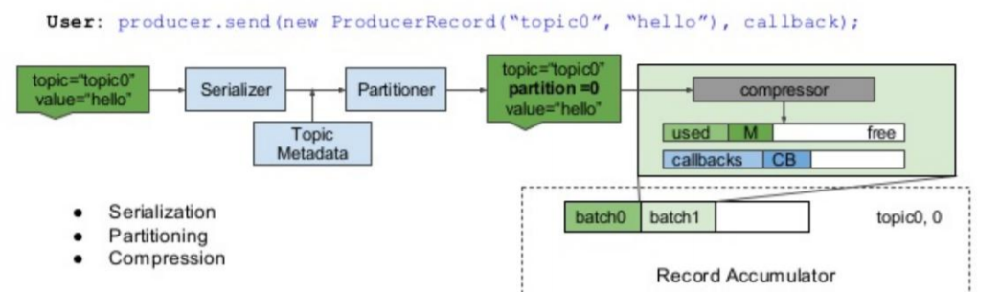
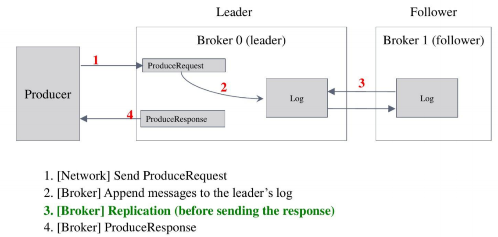

[TOC]


# Kafka概念与入门

Kafka 是一个消息系统，由 LinkedIn 于2011年设计开发，用作 LinkedIn 的活动流 （Activity Stream）和运营数据处理管道（Pipeline）的基础。 

Kafka 是一种 **分布式的**，**基于发布 / 订阅 **的消息系统

## 设计目标

1. 以时间复杂度为 O(1) 的方式提供**消息持久化能力**，即使对 TB 级以上数据也能保证常数时间复杂度的访问性能。 
2. **高吞吐率**。即使在非常廉价的商用机器上也能做到单机支持每秒 100K 条以上消息的传输。 
3. 支持 Kafka Server 间的 **消息分区**，及分布式消费，同时保证每个 **Partition** 内的消息**顺序传输**。 
4. 大数据：支持离线数据处理和实时数据处理。 
5. Scale out：支持在线**水平扩展**。


## Kafka的基本概念

1. `Broker`：Kafka 集群包含一个或多个服务器，这种服务器被称为 broker。(华尔街之狼接电话的代理)
2. `Topic`：每条发布到 Kafka 集群的消息都有一个类别，这个类别被称为 Topic。 （物理上不同 Topic 的消息分开存储，逻辑上一个 Topic 的消息虽然保存于一个或 多个 broker 上，但用户只需指定消息的 Topic 即可生产或消费数据而不必关心数据存于何处）。 （持久化的Topic，等同于开启持久化的activeMq的Topic）
3. `Partition`：Partition 是物理上的概念，每个 Topic 包含一个或多个 Partition。
4. `Producer`：**负责**发布消息到 Kafka broker。 
5. `Consumer`：消息消费者，向 Kafka broker **读取**消息的客户端。 
6. `Consumer Group`：每个 Consumer 属于一个特定的 Consumer Group（可为每个 Consumer 指定 group name，若不指定 group name 则属于默认的 group）**重点**


## 单机部署结构


## 集群部署结构


## Topic和Partition

**topic是逻辑概念，Partition是物理概念**

 多Partition支持水平扩展和并行处理，顺序写入提升吞吐性能 (如下图，一个topic创建4个partition，可以将其分布在4个机器上)


## Partition和Replica

 每个`partition`可以通过副本因子添加多个副本


## Topic特性 

1. 通过partition增加可扩展性 
2. 通过顺序写入达到高吞吐 
3. 多副本增加容错性

# Kafka的高级特性


## 生产者-执行步骤

客户端实现序列化，分区，压缩操作




## 生产者-确认模式

ack=0 : 只发送不管有没有写入到broker 

ack=1：写入到 leader就认为成功 

ack=-1/all：写入到最小的复本数则认为成功(使用这种)




## 生产者特性-同步发送

```java
KafkaProducer kafkaProducer = new KafkaProducer(pro);
ProducerRecord record = new ProducerRecord("topic","key","value");
Future future = kafkaProducer.send(record);
//同步发送方法1
Object o = future.get();
//同步发送方法2
kafkaProducer.flush();
```


## 生产者特性-异步发送

```java
pro.put("linger.ms","1");
pro.put("batch.size","10240");
KafkaProducer kafkaProducer = new KafkaProducer(pro);
ProducerRecord record = new ProducerRecord("topic","key","value");
Future future = kafkaProducer.send(record);
//异步发送方法1
kafkaProducer.send(record, (metadata, exception) -> {
	if (exception == null) {
        System.out.println("record =" + record);
    }
});
//异步发送方法2
kafkaProducer.send(record);
```


## 生产者特性-顺序保证


```java
pro.put("max.in.flight.requests.per.connection","1");
KafkaProducer kafkaProducer = new KafkaProducer(pro);
ProducerRecord record = new ProducerRecord("topic","key","value");
Future future = kafkaProducer.send(record);
//同步发送
kafkaProducer.send(record);
kafkaProducer.flush();
```


## 生产者特性-消息可靠性传递

```java
pro.put("enable.idempotence","true"); // 开启幂等，此时就会默认把acks设置为all
pro.put("transaction.id","tx0001");
try {
	kafkaProducer.beginTransaction();
	ProducerRecord record = new ProducerRecord("topic","key","value");
	for (int i = 0; i < 100; i++) {
		kafkaProducer.send(record, (metadata, exception) -> {
			if (exception != null) {
				kafkaProducer.abortTransaction();
				throw new KafkaException(exception.getMessage() + ", data: " + record);
	} }); }
	kafkaProducer.commitTransaction();
} catch (Throwable e) {
	kafkaProducer.abortTransaction();
}
```


## 消费者-Consumer Group

消费者与Partition对应关系


## 消费者特性-Offset提交

```java
props.put("enable.auto.commit","false");

props.put("enable.auto.commit","true"); // 自动提交
props.put("auto.commit.interval.ms","5000"); // 自动提交时间
while (true) {
	//拉取数据
	ConsumerRecords poll = consumer.poll(Duration.ofMillis(100));
	poll.forEach(o -> {
		ConsumerRecord<String, String> record = (ConsumerRecord) o;
		Order order = JSON.parseObject(record.value(), Order.class);
		System.out.println("order =	" + order);
	});
	//同步提交
	consumer.commitSync();
    //异步提交
    consumer.commitAsync();
}
```


## 消费者特性-Offset Seek