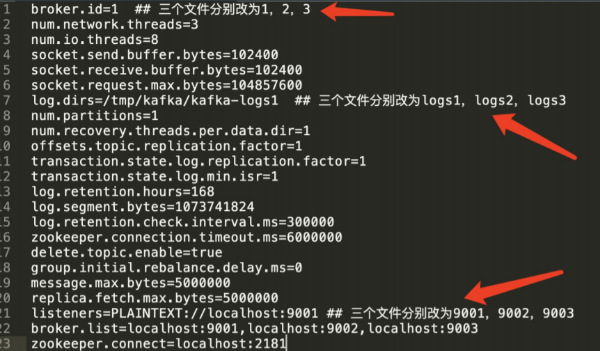

## 单机安装部署


启动kafka： 

命令行下进入kafka目录 

修改配置文件 `config/server.properties` 

打开 `listeners=PLAINTEXT://localhost:9092` 

```bash
.\zookeeper-server-start.bat ..\..\config\zookeeper.properties

.\kafka-server-start.bat ..\..\config\server.properties
```


简单性能测试 

```
.\bin\windows\kafka-producer-perf-test.bat --topic testk --num-records 100000 --record-size 1000 --throughput 100000 --producer-props bootstrap.servers=localhost:9092

100000 records sent, 30102.347983 records/sec (28.71 MB/sec), 697.54 ms avg latency, 959.00 ms max latency, 721 ms 50th, 946 ms 95th, 955 ms 99th, 958 ms 99.9th.
```


```
.\bin\windows\kafka-consumer-perf-test.bat  --bootstrap-server localhost:9092 --topic testk --fetch-size 1048576 --messages 100000 --threads 1
 
start.time, end.time, data.consumed.in.MB, 
2021-01-16 23:43:39:646, 2021-01-16 23:43:40:882

MB.sec, data.consumed.in.nMsg, nMsg.sec, rebalance.time.ms, fetch.time.ms, fetch.MB.sec, fetch.nMsg.sec
95.6631, 77.3973, 100310, 81156.9579, 1610811820258, -1610811819022, -0.0000, -0.0001
```


## 集群安装部署


选准备3个配置文件(server.properties)



清理掉zk上的所有数据，可以删除zk的本地文件或者用ZooInspector操作

三个命令行下进入kafka目录，分别执行 

```
.\kafka-server-start.bat ..\..\config\server1.properties
.\kafka-server-start.bat ..\..\config\server2.properties
.\kafka-server-start.bat ..\..\config\server3.properties
```


4、执行操作测试 创建带有副本的topic： 

```bash
//创建topic
.\kafka-topics.bat --zookeeper localhost:2181 --create --topic test32 --partitions 3 - -replication-factor 2 

// 查看topic的描述
.\kafka-topics.bat --zookeeper localhost:2181 --describe --topic test32

	    Topic: test32   PartitionCount: 3          ReplicationFactor: 2    Configs:
        Topic: test32   Partition: 0    Leader: 2       Replicas: 2,1   Isr: 2,1
        Topic: test32   Partition: 1    Leader: 3       Replicas: 3,2   Isr: 3,2
        Topic: test32   Partition: 2    Leader: 1       Replicas: 1,3   Isr: 1,3

//生产者
.\kafka-console-producer.bat --bootstrap-server localhost:9093 --topic test32 

//消费者
.\kafka-console-consumer.bat --bootstrap-server localhost:9091 --topic test32 --from-beginning 
```

(ISR: In-Sync Replica)

执行性能测试： 

.\kafka-producer-perf-test.bat --topic test32 --num-records 100000 --record-size 1000 --throughput 20000 --producer-props bootstrap.servers=localhost:9092 

.\kafka-consumer-perf-test.bat --bootstrap-server localhost:9092 --topic test32 --fetch-size 1048576 --messages 100000 --threads 1


## 