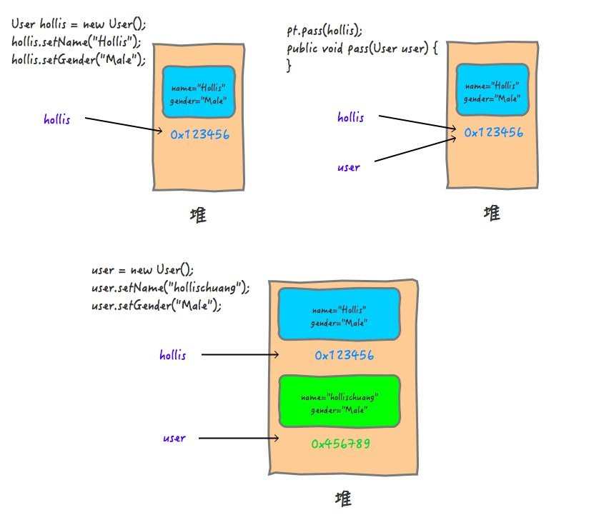

> `形式参数`：是在定义函数名和函数体的时候使用的参数,目的是用来接收调用该函数时传入的参数。

> `实际参数`：在调用有参函数时，主调函数和被调函数之间有数据传递关系。在主调函数中调用一个函数时，函数名后面括号中的参数称为“实际参数”。

---

> `值传递`（pass by value）是指在调用函数时将实际参数`复制`一份传递到函数中，这样在函数中如果对参数进行修改，将不会影响到实际参数。

> `引用传递`（pass by reference）是指在调用函数时将实际参数的`地址`直接传递到函数中，那么在函数中对参数所进行的修改，将影响到实际参数。





## 例子  

代码：
```java
public static void main(String[] args) {
   ParamTest pt = new ParamTest();

   User hollis = new User();
   hollis.setName("Hollis");
   hollis.setGender("Male");
   pt.pass(hollis);
   System.out.println("print in main , user is " + hollis);
}

public void pass(User user) {
   user = new User();
   user.setName("hollischuang");
   user.setGender("Male");
   System.out.println("print in pass , user is " + user);
}
```

输出结果：

```java
print in pass , user is User{name='hollischuang', gender='Male'}
print in main , user is User{name='Hollis', gender='Male'}
```


**把实参对象引用的地址当做值传递给了形式参数，所以说，Java中其实还是值传递的，只不过对于对象参数，值的内容是对象的引用。**


